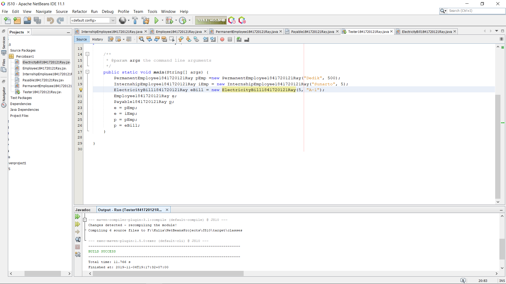
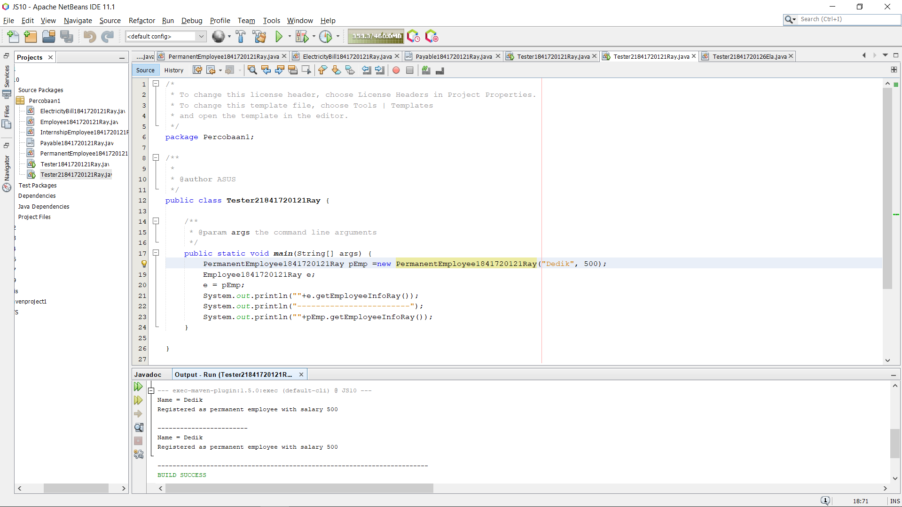
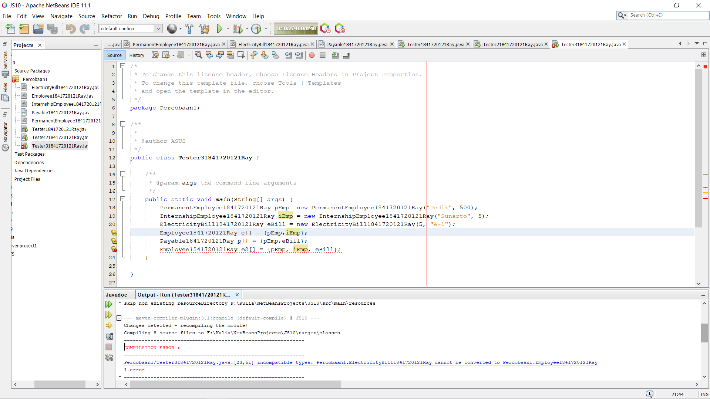
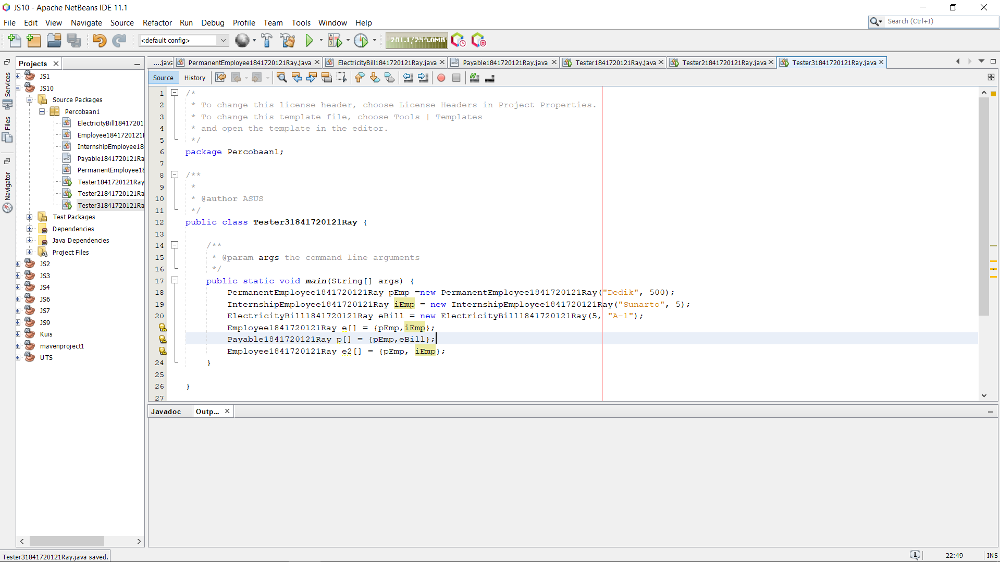

# Laporan Praktikum #10 - Polimorfisme

## Kompetensi

Setelah melakukan percobaan pada jobsheet ini, diharapkan mahasiswa mampu:
1. Memahami konsep dan bentuk dasar polimorfisme
2. Memahami konsep virtual method invication
3. Menerapkan polimorfisme pada pembuatan heterogeneous collection
4. Menerapkan polimorfisme pada parameter/argument method
5. Menerapkan object casting untuk meng-ubah bentuk objek

## Ringkasan Materi

>Polimorfisme merupakan kemampuan suatu objek untuk memiliki banyak bentuk. Penggunaan polimorfisme yang paling umum dalam OOP terjadi ketika ada referensi super class yang digunakan untuk merujuk ke objek dari sub class. Dengan kata lain, ketika ada suatu objek yang dideklarasikan dari super class, maka objek tersebut bisa diinstansiasi sebagai objek dari sub class.

## Percobaan

### Percobaan 1

Kode program pada Percobaan 1 : 

[ElectricityBill1841720121Ray.java](../../src/10_Polimorfisme/Percobaan1/ElectricityBill1841720121Ray.java)

[Employee1841720121Ray.java](../../src/10_Polimorfisme/Percobaan1/Employee1841720121Ray.java)

[InternshipEmployee1841720121Ray.java](../../src/10_Polimorfisme/Percobaan1/InternshipEmployee1841720121Ray.java)

[Payable1841720121Ray.java](../../src/10_Polimorfisme/Percobaan1/Payable1841720121Ray.java)

[PermanentEmployee1841720121Ray.java](../../src/10_Polimorfisme/Percobaan1/PermanentEmployee1841720121Ray.java)

[Tester1841720121Ray.java](../../src/10_Polimorfisme/Percobaan1/Tester1841720121Ray.java)

### Pertanyaan

1. Class apa sajakah yang merupakan turunan dari class Employee? 
2. Class apa sajakah yang implements ke interface Payable? 
3. Perhatikan class Tester1, baris ke-10 dan 11. Mengapa e, bisa diisi dengan objek pEmp (merupakan objek dari class PermanentEmployee) dan objek iEmp (merupakan objek dari class InternshipEmploye) ?  
4. Perhatikan class Tester1, baris ke-12 dan 13. Mengapa p, bisa diisi dengan objek pEmp (merupakan objek dari class PermanentEmployee) dan objek eBill (merupakan objek dari class ElectricityBill) ? 
5. Coba tambahkan sintaks: p = iEmp;      e = eBill; pada baris 14 dan 15 (baris terakhir dalam method main) ! Apa yang menyebabkan error? 
6. Ambil kesimpulan tentang konsep/bentuk dasar polimorfisme! 

### Jawaban

1. class IntershipEmployee1841720121Ray dan class PermanenrEmployee1841720121Ray

2. class PermanentEmployee1841720121Ray dan class ElectricityBill1841720121Ray

3. Karena merupakan turunan class Employee dimana class Employee diinstasiasi dengan objek e, keduanya sama – sama turunan dari class Employee1841720121Ray

4. Karena class PermanentEmployee1841720121Ray dan ElectricityBill1841720121Ray mengimplentasi interface dari class Payable.

5. Karena Class PermanentEmployee1841720121Ray dan InternshipEmployee1841720121Ray merupakan turunan dari Class Payable.

6. Polimorfisme bisa diterapkan pada class-class yang memiliki relasi inheritance dan interface. Ketika ada objek yang dideklarasikan dari suatu interface, maka ia bisa digunakan untuk mereferensikan ke objek yang mengimplements class interface tersebut.

### Percobaan 2

Kode program pada Percobaan 2 : 

[Tester21841720121Ray.java](../../src/10_Polimorfisme/Percobaan2/Tester21841720121Ray.java)

### Pertanyaan

1. Perhatikan class Tester2 di atas, mengapa pemanggilan e.getEmployeeInfo() pada baris 8 dan pEmp.getEmployeeInfo() pada baris 10 menghasilkan hasil sama?  
2. Mengapa pemanggilan method e.getEmployeeInfo() disebut sebagai pemanggilan method virtual (virtual method invication), sedangkan pEmp.getEmployeeInfo() tidak? 
3. Jadi apakah yang dimaksud dari virtual method invocation? Mengapa disebut virtual?

### Jawaban

1. Karena e dan pEmp sama – sama instan dari PermanentEmployee1841720121Ray.

2. Karena objek pEmp dan eBill merupakan object dari class yang mengimplements dari class Payable1841720121Ray.

3. Virtual method invocation terjadi ketika ada pemanggilan overriding method dari suatu objek polimorfisme. Disebut virtual karena antara method yang dikenali oleh compiler dan method yang dijalankan oleh JVM berbeda.

### Percobaan 3

# Sudah diperbaiki 

Kode program pada Percobaan 3 : 

[Tester31841720121Ray.java](../../src/10_Polimorfisme/Percobaan3/Tester31841720121Ray.java)

### Pertanyaan

1. Perhatikan array e pada baris ke-8, mengapa ia bisa diisi dengan objek-objek dengan tipe yang berbeda, yaitu objek pEmp (objek dari PermanentEmployee) dan objek iEmp (objek dari InternshipEmployee) ? 
2. Perhatikan juga baris ke-9, mengapa array p juga biisi dengan objekobjek dengan tipe yang berbeda, yaitu objek pEmp (objek dari PermanentEmployee) dan objek eBill (objek dari ElectricityBilling) ? 
3. Perhatikan baris ke-10, mengapa terjadi error? 

### Jawaban

1. karena objek pEmp dan iEmp merupakan object dari class yang merupakan turunan dari class Employee.

2. Karena objek pEmp dan eBill merupakan object dari class yang mengimplements dari class Payable.

3. Karena eBill bukan termasuk Class turunan dari Class Employee. 

### Percobaan 4