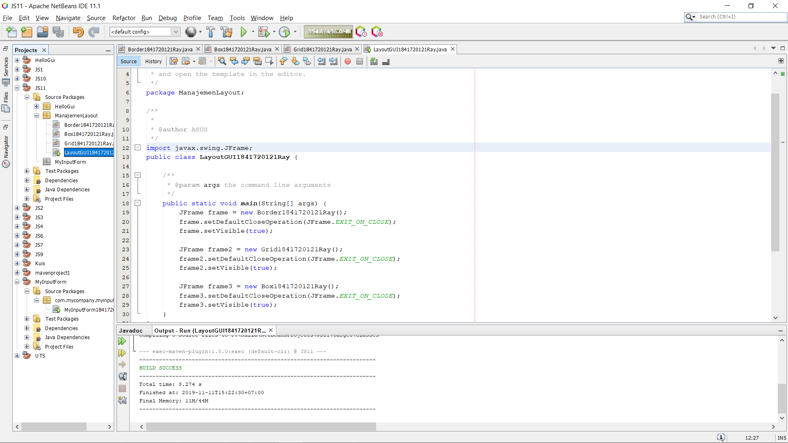
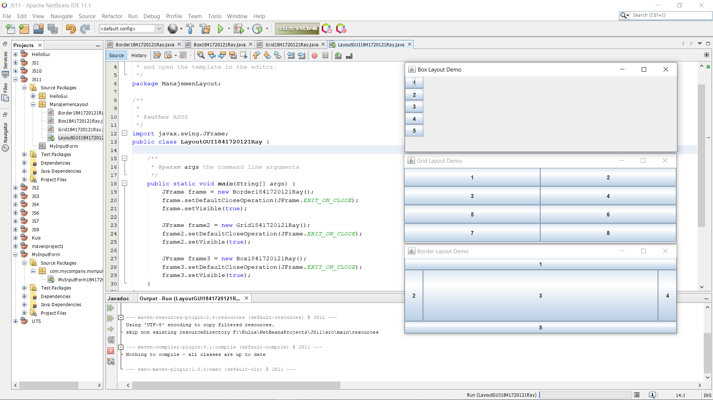
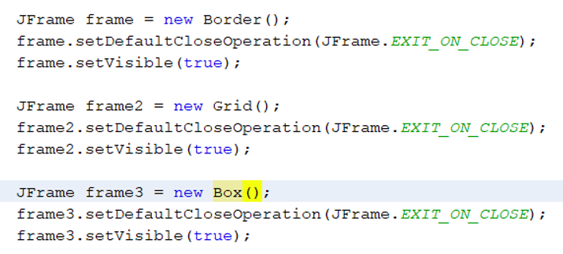
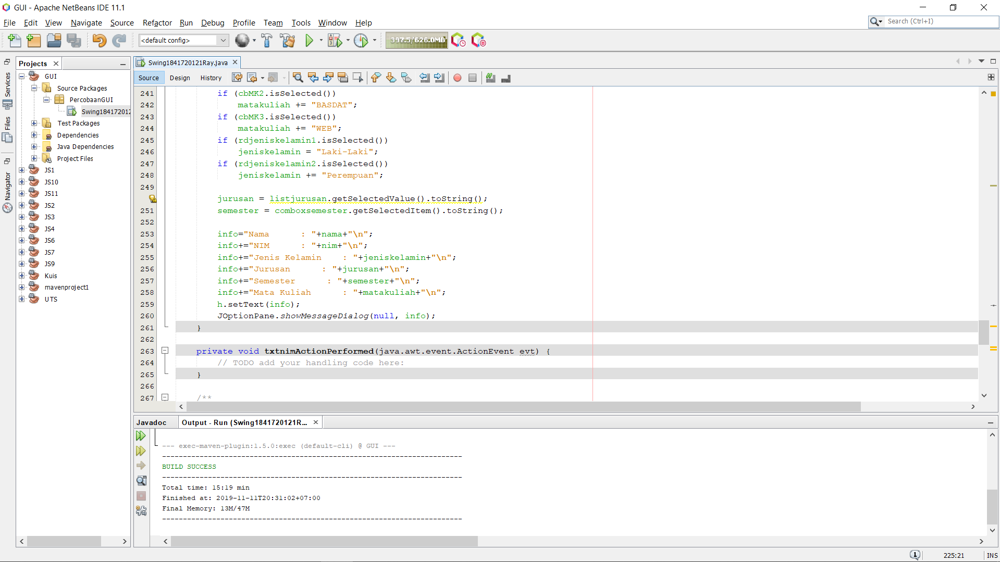
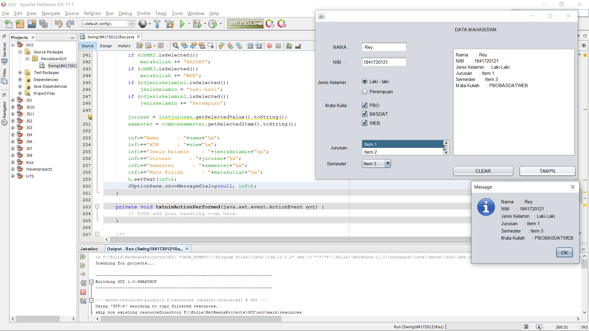
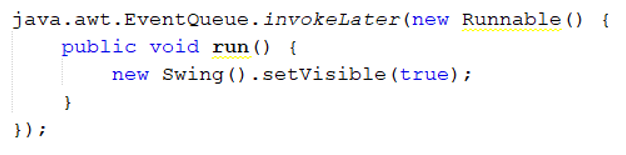
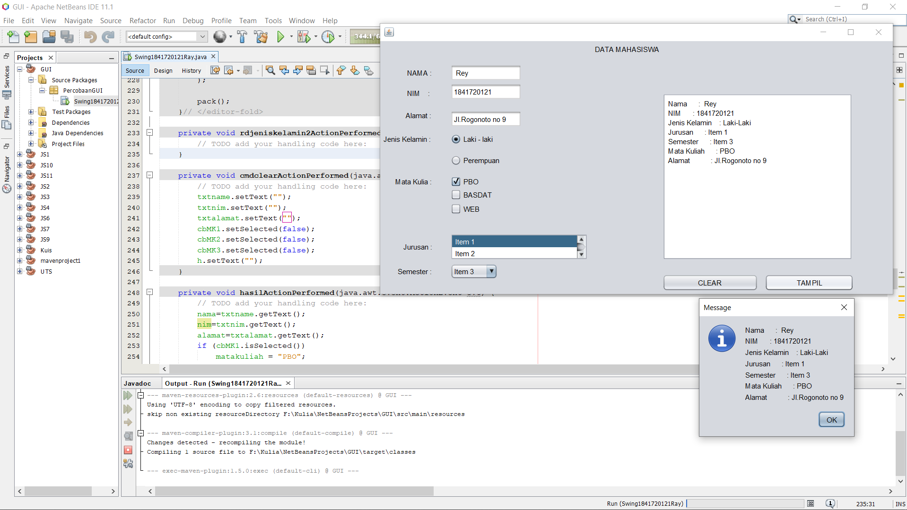
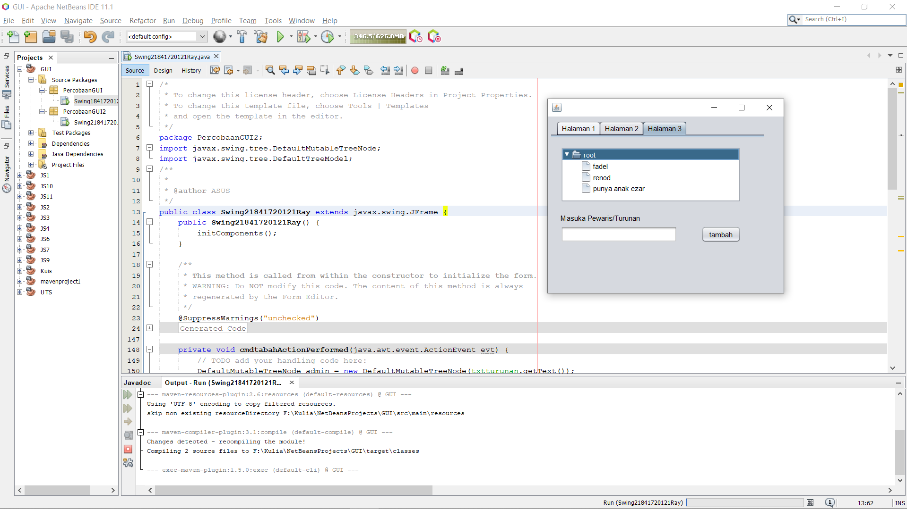
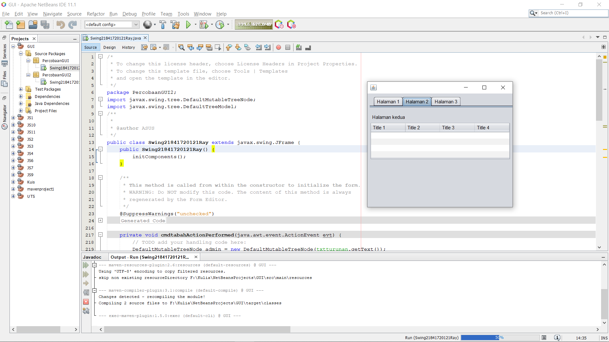
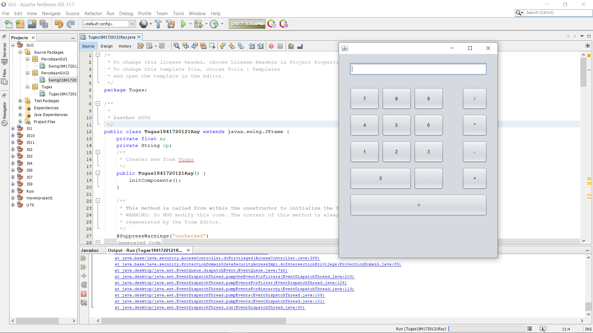

# Laporan Praktikum #10 - GUI

## Kompetensi

1. Membuat aplikasi Graphical User Interface sederhana dengan bahasa pemrograman java.
2. Mengenal komponen GUI seperti frame, label, textfield, combobox, radiobutton, checkbox, textarea, menu, serta table.
3. Menambahkan event handling pada aplikasi GUI.

## Ringkasan Materi

>JFrame Untuk membuat aplikasi Java berbasis GUI, kita butuh sebuah frame atau applet untuk media eksekusi aplikasi GUI. Pada Java sebuah frame dapat diwakili oleh sebuah kelas, yaitu JFrame. Melalui kelas JFrame kita bisa mendesain tampilan Java GUI sesuai kebutuhan.

## Percobaan

### Percobaan 1 - JFrame HelloGUI

Kode program pada Percobaan 1 : 

[HelloGui1841720121Ray.java](../../src/11_GUI/HelloGui/HelloGui1841720121Ray.java)

### Percobaan 2 - Menangani Input Pada GUI 

[MyInputForm1841720121Ray.java](../../src/11_GUI/MyInputForm/MyInputForm1841720121Ray.java)

### Pertanyaan
1. Modifikasi kode program dengan menambahkan JButton baru untuk melakukan fungsi perhitungan penambahan, sehingga ketika button di klik (event click) maka akan menampilkan hasil penambahan dari nilai A dan B 

### Jawab

1. 

[MyInputForm1841720121Ray.java](../../src/11_GUI/pertanyaan/MyInputForm1841720121Ray.java)

### Percobaan 3 - Manajemen Layout

[Border1841720121Ray.java](../../src/11_GUI/ManajemenLayout/Border1841720121Ray.java)

[Box1841720121Ray.java](../../src/11_GUI/ManajemenLayout/Box1841720121Ray.java)

[Grid1841720121Ray.java](../../src/11_GUI/ManajemenLayout/Grid1841720121Ray.java)

[LayoutGUI1841720121Ray.java](../../src/11_GUI/ManajemenLayout/LayoutGUI1841720121Ray.java)

### Pertanyaan

1. Apa perbedaan dari Grid Layout, Box Layout dan Border Layout? 
2. Apakah fungsi dari masing-masing kode berikut? 

### Jawaban

1. 
>Border layout menyusun komponen ke lima bagian yaitu: NORTH, SOUTH, EAST,WEST, and CENTER. Masing - masing bagian ini dapat menampung lebih dari satu komponen

>Grid layout menempatkan komponen dalam bentuk “rectangular grid” dan membaginya ke ukuran yang sama dalam bentuk kotak dan masing masing komponen di letakkan pada satu kotak

>Box layout menempatkan komponen dalam satu baris atau satu kolom berbentuk box
2. 
>Proses Inisiasi setiap objek yang akan membuat setiap frame layout.

>setDefaultCloseOperation digunakan untuk perintah Program akan berhenti jika ditutup.

>SetVisible digunakan untuk menampilkan frame jika di set true;

### Percobaan 4 - Membuat GUI Melalui IDE Netbeans

[Swing1841720121Ray.form](../../src/11_GUI/percobaanGUI/Swing1841720121Ray.form)

[Swing1841720121Ray.java](../../src/11_GUI/percobaanGUI/Swing1841720121Ray.java)

### Pertanyaan 

1. Apakah fungsi dari kode berikut? 

2. Mengapa pada bagian logika checkbox dan radio button digunakan multiple if ? 

3.  Lakukan modifikasi pada program untuk melakukan menambahkan inputan berupa alamat dan berikan fungsi pemeriksaan pada nilai Alamat tersebut jika belum diisi dengan menampilkan pesan peringatan 

### Jawaban

1. Koding tersebut untuk menjalankan atau membuat dan menampilkan form.

2. dikarenakan kita membuat kondisi di setiap variable di checkbox dan radio button.

3. 

[Swing1841720121Ray.form](../../src/11_GUI/pertanyaan/Swing1841720121Ray.form)

[Swing1841720121Ray.java](../../src/11_GUI/pertanyaan/Swing1841720121Ray.java)

### Percobaan 5 - JTabPane, JTtree, JTable

[Swing21841720121Ray.form](../../src/11_GUI/percobaanGUI2/Swing21841720121Ray.form)

[Swing21841720121Ray.java](../../src/11_GUI/percobaanGUI2/Swing21841720121Ray.java)

### Pertanyaan 

1. Apa kegunaan komponen swing JTabPane, JTtree, pada percobaan 5? 

2. Modifikasi program untuk menambahkan komponen JTable pada tab Halaman 1 dan tab Halaman 2 

### Jawaban

1. 
>Fungsi komponen swing JTabpane digunakan untuk membuat panel yang menyediakan tab yang bisa membuat sekaligus beberapa halaman di satu panel.

>Fungsi komponen swing Jtree untuk menampilkan data dengan hirarki properti dengan menambahkan node ke node dan menyimpan konsep induk dan anak node.

2. 

[Swing21841720121Ray.form](../../src/11_GUI/pertanyaan/Swing21841720121Ray.form)

[Swing21841720121Ray.java](../../src/11_GUI/pertanyaan/Swing21841720121Ray.java)

### Tugas

[Tugas1841720121Ray.form](../../src/11_GUI/Tugas/Tugas1841720121Ray.form)

[Tugas1841720121Ray.java](../../src/11_GUI/Tugas/Tugas1841720121Ray.java)

## Pernyataan Diri

Saya menyatakan isi tugas, kode program, dan laporan praktikum ini dibuat oleh saya sendiri. Saya tidak melakukan plagiasi, kecurangan, menyalin/menggandakan milik orang lain.

Jika saya melakukan plagiasi, kecurangan, atau melanggar hak kekayaan intelektual, saya siap untuk mendapat sanksi atau hukuman sesuai peraturan perundang-undangan yang berlaku.

Ttd,

***(Muhammad Rayhan Akbar Putra)***