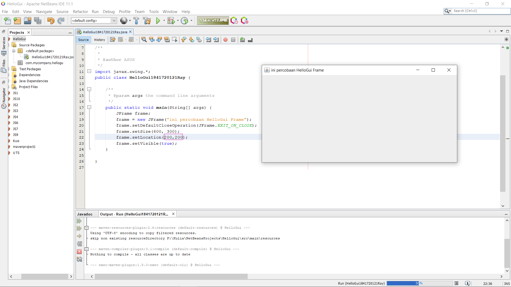
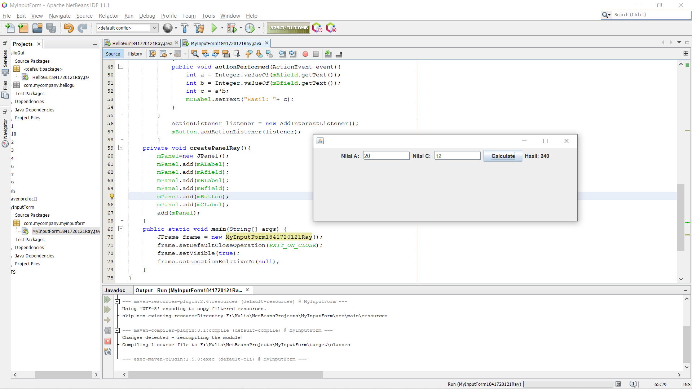
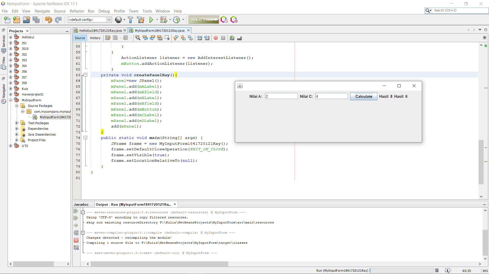

# Laporan Praktikum #10 - GUI

## Kompetensi

1. Membuat aplikasi Graphical User Interface sederhana dengan bahasa pemrograman java.
2. Mengenal komponen GUI seperti frame, label, textfield, combobox, radiobutton, checkbox, textarea, menu, serta table.
3. Menambahkan event handling pada aplikasi GUI.

## Ringkasan Materi

>JFrame Untuk membuat aplikasi Java berbasis GUI, kita butuh sebuah frame atau applet untuk media eksekusi aplikasi GUI. Pada Java sebuah frame dapat diwakili oleh sebuah kelas, yaitu JFrame. Melalui kelas JFrame kita bisa mendesain tampilan Java GUI sesuai kebutuhan.

## Percobaan

### Percobaan 1 - JFrame HelloGUI

Kode program pada Percobaan 1 : 

[HelloGui1841720121Ray.java](../../src/11_GUI/HelloGui/HelloGui1841720121Ray.java)

### Percobaan 2 - Menangani Input Pada GUI 

[MyInputForm1841720121Ray.java](../../src/11_GUI/MyInputForm/MyInputForm1841720121Ray.java)

### Pertanyaan
1. Modifikasi kode program dengan menambahkan JButton baru untuk melakukan fungsi perhitungan penambahan, sehingga ketika button di klik (event click) maka akan menampilkan hasil penambahan dari nilai A dan B 

### Jawab

1. 

[MyInputForm1841720121Ray.java](../../src/11_GUI/pertanyaan/MyInputForm1841720121Ray.java)

### Percobaan 3 - Manajemen Layout

