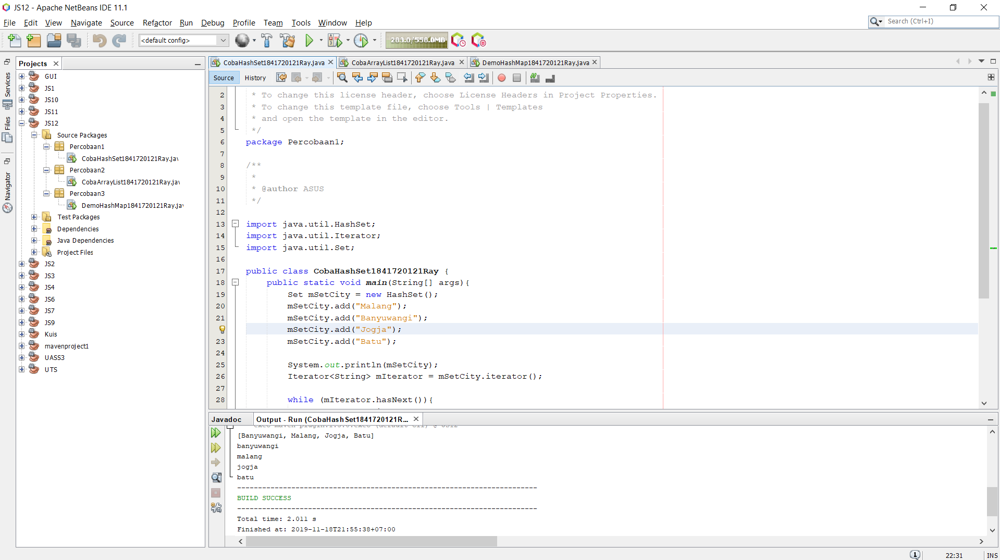
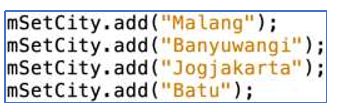
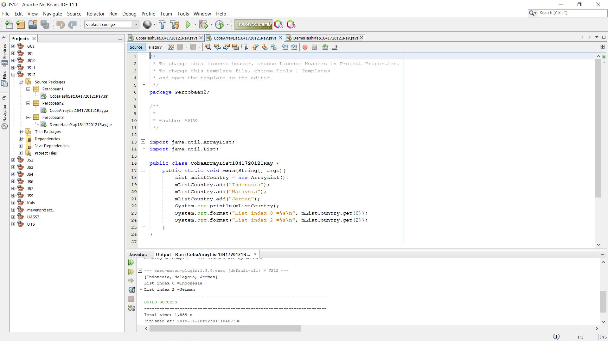
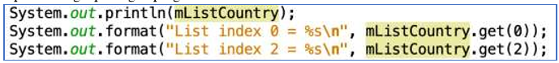
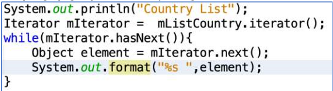
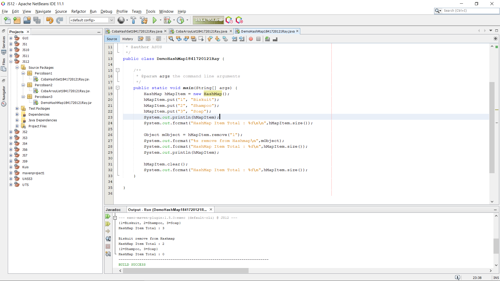
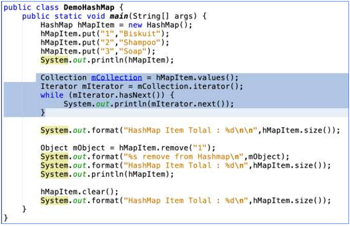

# Laporan Praktikum #12 - Java API

## Kompetensi

1. Memahami cara penyimpanan objek menggunakan Collection dan Map. 
2. Mengetahui pengelompokan dari Collection. 
3. Mengetahui perbedaan dari interface Set, List dan Map. 
4. Mengetahui penggunaan class-class dari interface Set, List, dan Map. 
5. Memahami koneksi database menggunakan JDBC dan JDBC API 

## Ringkasan Materi

> 

## Percobaan

### Percobaan 1 - Set

Kode program pada Percobaan 1 : 

[CobaHashSet1841720121Ray.java](../../src/12_Java_API/Percobaan1/CobaHashSet1841720121Ray.java)

### Pertanyaan

1. Apakah fungsi import java.util.*; pada program diatas! 

2. Pada baris program keberapakah yang berfungsi untuk menciptakan object HashSet? 

3. Apakah fungsi potongan program dibawah ini pada percobaan 1! 

4. Tambahkan set.add(“Malang”); kemudian jalankan program! Amati hasilnya dan jelaskan mengapa terjadi error! 

5. Jelaskan fungsi potongan program dibawah ini pada percobaan 1! 

### Jawaban

1. 

2. 

3. 

4. 

5. 

### Percobaan 2 - List

Kode program pada Percobaan 2 : 

[CobaArrayList1841720121Ray.java](../../src/12_Java_API/Percobaan2/CobaArrayList1841720121Ray.java)

### Pertanyaan

1. Apakah fungsi potongan program dibawah ini! 

2. Ganti potongan program pada soal no 1 menjadi sebagai berikut

3. Jelaskan perbedaan menampilkan data pada ArrayList menggunakan potongan program pada soal no 1 dan no 2! 

### Jawaban

1. 

2. 

3. 

### Percobaan 3 - Map

Kode program pada Percobaan 3 : 

[DemoHashMap1841720121Ray.java](../../src/12_Java_API/Percobaan3/DemoHashMap1841720121Ray.java)

### Pertanyaan

1. Jelaskan fungsi hMapItem.put("1","Biskuit") pada program! 

2. Jelaskan fungsi hMapItem.size() pada program! 

3. Jelaskan fungsi hMapItem.remove("1") pada program! 

4. Jelaskan fungsi hMapItem.clear() pada program! 

5. Tambahkan kode program yang di blok pada program yang sudah anda buat! 

6. Jalankan program dan amati apa yang terjadi! 

7. Apakah perbedaan program sebelumnya dan setelah ditambahkan kode program pada soal no 5 diatas? Jelaskan!

### Jawaban

1. 

2. 

3. 

4. 

5. 

6. 

7. 

### Percobaan 4 - Implementasi ArrayList dalam GUI

