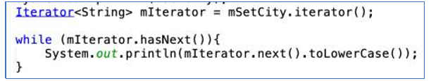
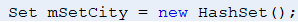

# Laporan Praktikum #12 - Java API

## Kompetensi

1. Memahami cara penyimpanan objek menggunakan Collection dan Map. 
2. Mengetahui pengelompokan dari Collection. 
3. Mengetahui perbedaan dari interface Set, List dan Map. 
4. Mengetahui penggunaan class-class dari interface Set, List, dan Map. 
5. Memahami koneksi database menggunakan JDBC dan JDBC API 

## Ringkasan Materi

> 

## Percobaan

### Percobaan 1 - Set

Kode program pada Percobaan 1 : 

[CobaHashSet1841720121Ray.java](../../src/12_Java_API/Percobaan1/CobaHashSet1841720121Ray.java)

### Pertanyaan

1. Apakah fungsi import java.util.*; pada program diatas! 

2. Pada baris program keberapakah yang berfungsi untuk menciptakan object HashSet? 

3. Apakah fungsi potongan program dibawah ini pada percobaan 1! 

4. Tambahkan set.add(“Malang”); kemudian jalankan program! Amati hasilnya dan jelaskan mengapa terjadi error! 

5. Jelaskan fungsi potongan program dibawah ini pada percobaan 1! 

### Jawaban

1. import java.util.*; fungsinya: mengimpor semua kelas di dalam java.

2. 

3. Untuk mengisi data index pada array

4. Terjadi error Karena dalam pengisian data membutuhkan objek

5. Iterator digunakan untuk mengakses dan menampilkan nilai beserta tambahan method lain yang didefinisikan di dalam interface Iterator.
Kode tersebut juga digunakan untuk menampilkan nilai dengan lower case

### Percobaan 2 - List

Kode program pada Percobaan 2 : 

[CobaArrayList1841720121Ray.java](../../src/12_Java_API/Percobaan2/CobaArrayList1841720121Ray.java)

### Pertanyaan

1. Apakah fungsi potongan program dibawah ini! 

2. Ganti potongan program pada soal no 1 menjadi sebagai berikut

3. Jelaskan perbedaan menampilkan data pada ArrayList menggunakan potongan program pada soal no 1 dan no 2! 

### Jawaban

1. untuk menampilkan data berupa string dimana sesuai pada indeks array yang dipanggil

2. 

[CobaArrayList1841720121Ray.java](../../src/12_Java_API/Pertanyaan/CobaArrayList1841720121Ray.java)

3. pada soal no 1 pemanggilan data menggunakan inputan indeks array, sedangkan pada soal no 2 menggunakan iterasi, dimana jika ada data maka akan ditampilkan secara berurutan, jika tidak ada, makan proses iterasi berhenti

### Percobaan 3 - Map

Kode program pada Percobaan 3 : 

[DemoHashMap1841720121Ray.java](../../src/12_Java_API/Percobaan3/DemoHashMap1841720121Ray.java)

### Pertanyaan

1. Jelaskan fungsi hMapItem.put("1","Biskuit") pada program! 

2. Jelaskan fungsi hMapItem.size() pada program! 

3. Jelaskan fungsi hMapItem.remove("1") pada program! 

4. Jelaskan fungsi hMapItem.clear() pada program! 

5. Tambahkan kode program yang di blok pada program yang sudah anda buat! 

6. Jalankan program dan amati apa yang terjadi! 

7. Apakah perbedaan program sebelumnya dan setelah ditambahkan kode program pada soal no 5 diatas? Jelaskan!

### Jawaban

1. Mengisi map dengan pasangan kunci dan nilai. Kedua-dua kunci dan nilai bisa berupa objek apa saja. Jika map tersebut telah memiliki kunci maka nilai yang ditunjuk akan diganti dengan yang baru diberikan. Perintah ini mirip dengan “A[kunci] = nilai” pada array.

2. Untuk mengembalikan int yang berisi jumlah pasangan asosiasi pada map

3. untuk menghapus kunci beserta nilai yang ditunjuknya, atau dengan kata lain menghapus pasangan kunci dan nilai pada map sekaligus

4. menghapus semua pasangan asosiasi dalam map.

5. 

6. 

[DemoHashMap1841720121Ray.java](../../src/12_Java_API/Pertanyaan/DemoHashMap1841720121Ray.java)

7. Kode program diatas mIterator digunakan untuk menampilkan element pada collection. Yang mana mCollection tersebut mengambil value dari hMapItem.

### Percobaan 4 - Implementasi ArrayList dalam GUI

[InputData1841720121Ray.java](../../src/12_Java_API/Percobaan4/InputData1841720121Ray.java)

[Mahasiswa1841720121Ray.java](../../src/12_Java_API/Percobaan4/Mahasiswa1841720121Ray.java)

[TampilGui1841720121Ray.form](../../src/12_Java_API/Percobaan4/TampilGui1841720121Ray.form)

[TampilGui1841720121Ray.java](../../src/12_Java_API/Percobaan4/TampilGui1841720121Ray.java)

