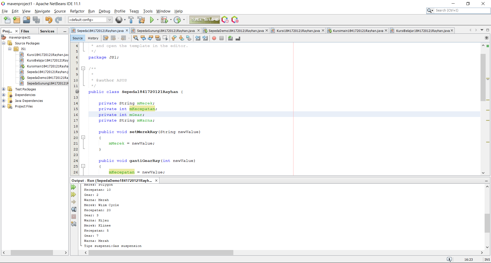
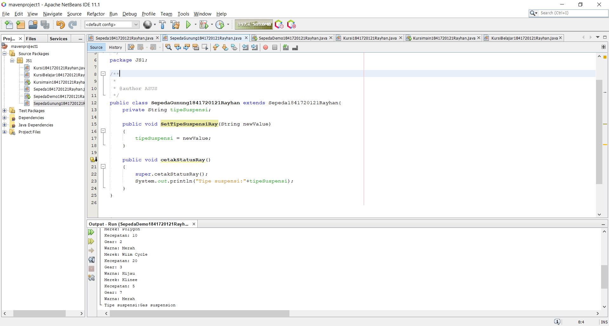
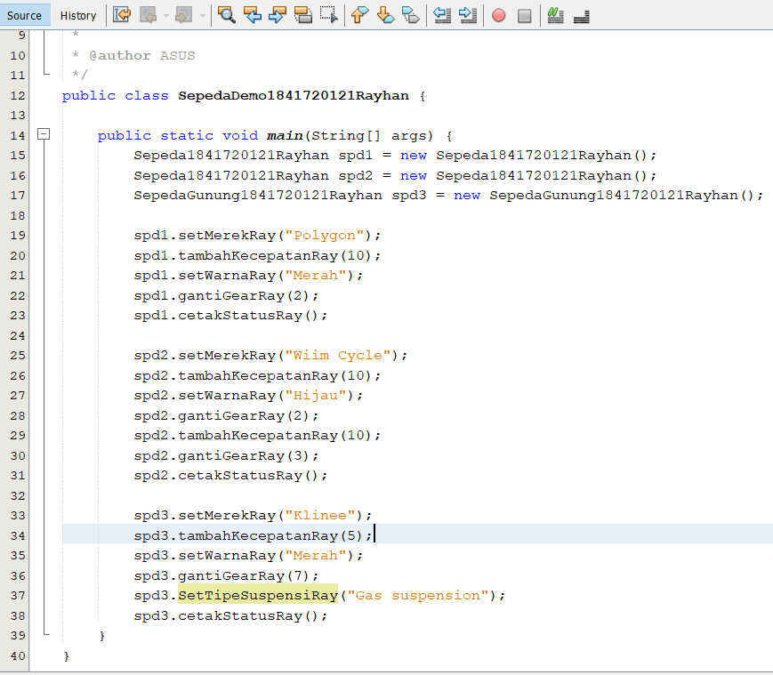
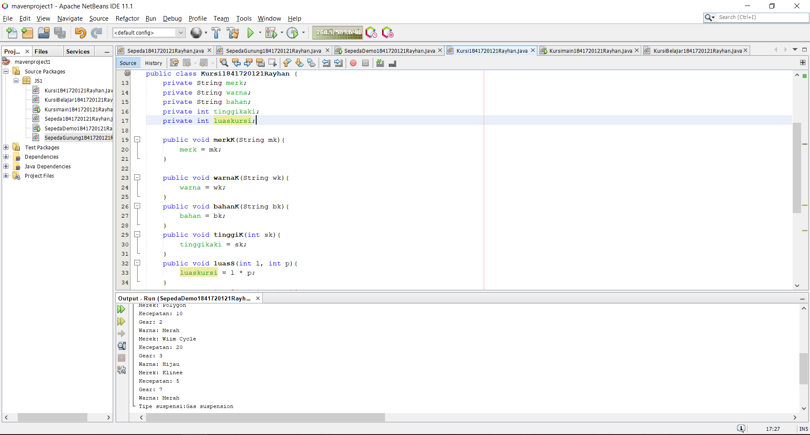

# Laporan Praktikum #1 - Pengantar Konsep PBO

## Kompetensi

Setelah menempuh materi percobaan ini, mahasiswa mampu mengenal: 
1. Perbedaan paradigma berorientasi objek dengan paradigma struktural 
2. Konsep dasar PBO 

## Ringkasan Materi

Terkadang error saat melakukan running coding ternyata kesalahan terdapat di atribut karena salah pengetikan dan peletakan

## Percobaan

### Percobaan 1

Didalam percobaan ini kita dapat mendemonstrasikan bagaimana membuat class, object

Contoh link kode program : [ini contoh link ke kode program](../../src/1_Pengantar_Konsep_PBO/Sepeda1841720121Rayhan.java)

### Percobaan 2

Dalam percobaan ini kita membuat class SepedaGunung yang mana adalah turunan dari class Sepeda. Pada dasarnya class SepedaGunung adalah sama dengan class Sepeda, hanya saja pada sepeda gunung terdapat tipe suspensi.  Untuk itu kita tidak perlu membuat class Sepeda Gunung dari nol, tapi kita wariskan saja class Sepeda ke class SepedaGunung. 

Contoh link kode program : [ini contoh link ke kode program](../../src/1_Pengantar_Konsep_PBO/SepedaGunung1841720121Rayhan.java)

## Pertanyaan

1. Object, Class, Inheritance, Polimorfisme, Enkapulasi.
2. Object merupakan rangakaian dalam program yang terdapat state yang atributnya dari objek itu sendiri dan behavior. Perbedaan dengan Class ialah prototype atau rancangan pada suatu objek.
3. Kelebihan Pemrograman Berbasis Objek yaitu :
    
A. Dalam menggunakan sebuah class cukup sekali tidak perlu dituis berkali-kali.
    
B. Data yang digunakan dalam bentuk private hanya bisa di akses oleh fungsi lokasi, sehingga tidak perlu khawatir untuk berpengaruh pada fungsi lainnya.
    
c. Dapat menambahkan fitur pada class tanpa mengedit class asal.

4. Merek, kecepatan dan gear
5. 

6. Karena class sepedagunung.java sudah extend atau sudah diwarisi oleh class sepeda.

## Tugas

Contoh link kode program : [ini contoh link ke kode program](../../src/1_Pengantar_Konsep_PBO/Kursi1841720121Rayhan.java)

## Kesimpulan

Dari percobaan diatas, kita telah mendemonstrasikan bagaimana paradigma pemrograman berorientasi objek dan mengimplementasikannya kedalam program sederhana. 

## Pernyataan Diri

Saya menyatakan isi tugas, kode program, dan laporan praktikum ini dibuat oleh saya sendiri. Saya tidak melakukan plagiasi, kecurangan, menyalin/menggandakan milik orang lain.

Jika saya melakukan plagiasi, kecurangan, atau melanggar hak kekayaan intelektual, saya siap untuk mendapat sanksi atau hukuman sesuai peraturan perundang-undangan yang berlaku.

Ttd,

***(Muhammad Rayhan Akbar Putra)***