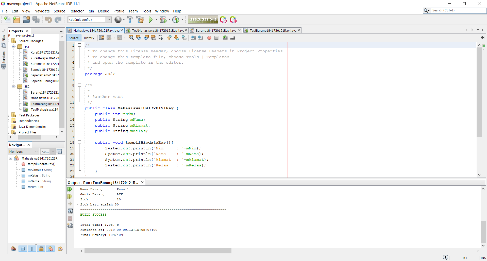
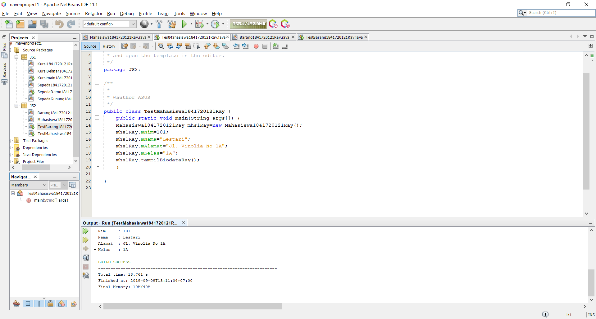
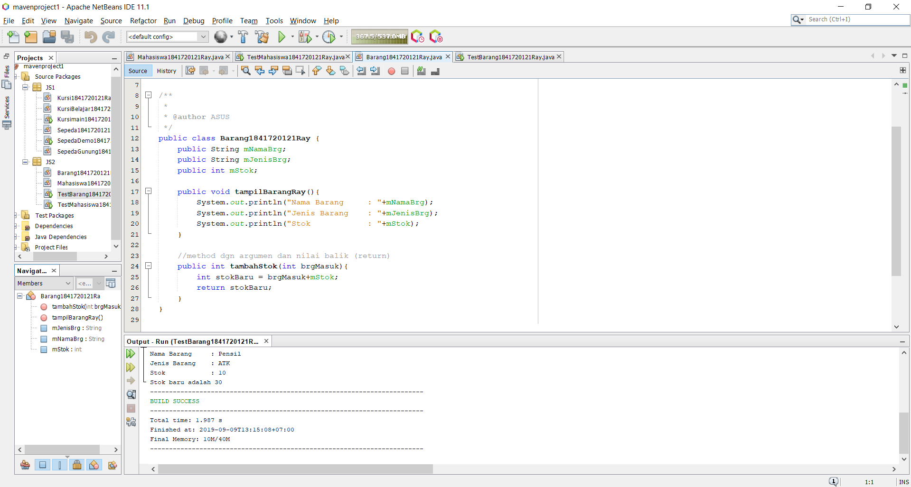
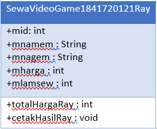
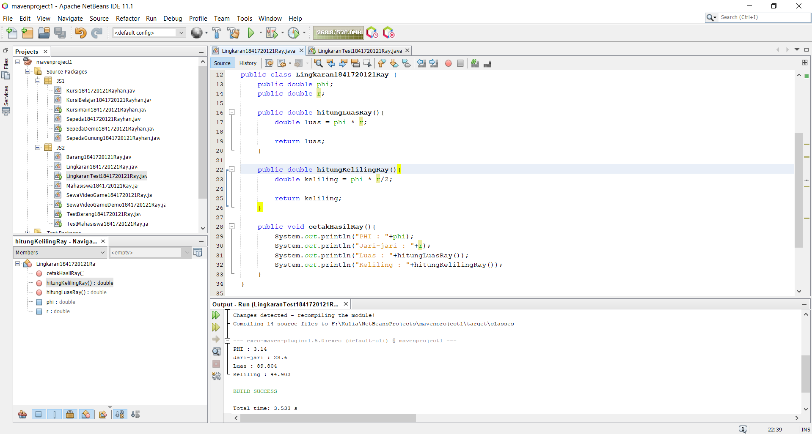
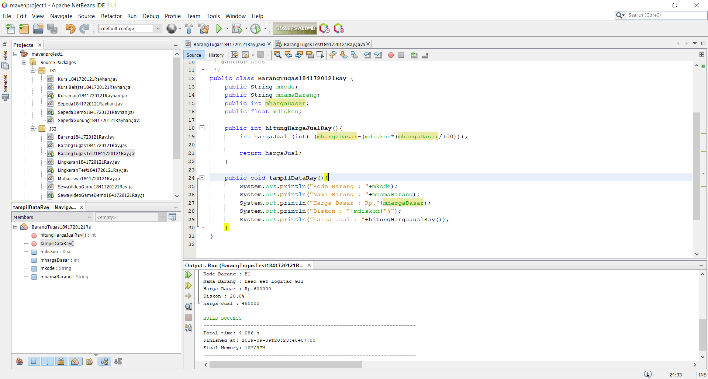

# Laporan Praktikum #2 - Class dan Object

## Kompetensi

 Kompetensi
 1. Mahasiswa dapat memahami deskripsi dari class dan object
 2. Mahasiswa memahami implementasi dari class
 3. Mahasiswa dapat memahami implementasi dari attribute
 4. Mahasiswa dapat memahami implementasi dari method
 5. Mahasiswa dapat memahami implementasi dari proses instansiasi
 6. Mahasiswa dapat memahami implementasi dari try-catch
 7. Mahasiswa dapat memahami proses pemodelan class diagram menggunakan UML 

## Ringkasan Materi

    Suatu class diagram pada java adalah rancangan dasar pada suatu pembuatan program. Pada praktikum dan tugas terdapat method yang dapat mengembalikan nilai yang gunanya sendiri adalah pada suatu studi kasus yang didalamnya tidak hanya menampilkan suatu inputan data saja namun, juga mengembalikan nilai perhitungan dari inputan data tersebut.

## Percobaan

### Percobaan 1

Pada percobaan pertama adalah membuat class diagram dari suatu studi kasus dan juga beberapa pertanyaan sebagai berikut :

Dalam suatu perusahaan salah satu data yang diolah adalah data karyawan. Setiap karyawan memiliki id, nama, jenis kelamin, jabatan, jabatan, dan gaji. Setiap mahasiswa juga bisa menampilkan data pribadi. 
 

1. Gambarkan desain class diagram dari studi kasus 1!

jawaban :

2. Sebutkan Class apa saja yang bisa dibuat dari studi kasus 1!

jawaban : Karyawan

3. Sebutkan atribut beserta tipe datanya yang dapat diidentifikasi dari masing-masing class dari studi kasus 1!

 Atribut yang ada pada class diagram Karyawan antara lain :
   
   a. Atribut id dengan tipe data integer

   b. Atribut nama dengan tipe data String

   c. Atribut gaji dengan tipe data double

   d. Atribut jabatan dengan tipe data String

   e. Atribut jenisKelamin dengan tipe data String

4. Sebutkan method-method yang sudah anda buat dari masing-masing class pada studi kasus 1 
terdapat dua method yang sudah dibuat yaitu :
   
   a. tampilBiodata

   b. tampilGaji

### Percobaan 2

Pada percobaan ke 2 adallah membuat program dengan class diagram yang sudah disediakan pada jobsheet, class diagram dari Mahasiswa yang berisi atribut nim dengan tipe data int, nama dengan tipe data String, alamat dengan tipe data String, kelas dengan tipe data String, Terdapat methode pada class diagram Mahasiswa  (tampilBiodata).

Contoh link kode program pada class :
[ini contoh link ke kode program](../../src/2_Class_dan_Object/Mahasiswa1841720121Ray.java)

Contoh link kode program pada class :
[ini contoh link ke kode program](../../src/2_Class_dan_Object/TestMahasiswa1841720121Ray.java)

### Percobaan 3

 Pada class Barang terdapat tiga atribut : namaBarang, jenisBarang dan stok. selain atribut terdapat method pada class yaitu tampilBarang dan tambahStok.

Contoh link kode program pada class :
[ini contoh link ke kode program](../../src/2_Class_dan_Object/Barang1841720121Ray.java)

Contoh link kode program pada class :
[ini contoh link ke kode program](../../src/2_Class_dan_Object/TestBarang1841720121Ray.java)

#### Kesimpulan : 

Kegunaan return adalah untuk mengembalikan nilai dari suatu method yang didalamnya terdapat perhitungan.

## Tugas

1. Suatu toko persewaan video game salah satu yang diolah adalah peminjaman, dimana data yang dicatat ketika ada orang yang melakukan peminjaman adalah id, nama member, nama game, dan harga yang harus dibayar. Setiap peminjaman bisa menampilkan data hasil peminjaman dan harga yang harus dibayar. Buatlah class diagram pada studi kasus diatas! 
 
    Penjelasan:
  
    a. Harga yang harus dibayar diperoleh dari lama sewa x harga.
   
    b. Diasumsikan 1x transaksi peminjaman game yang dipinjam hanya 1 game saja.

    

2. Buatlah program dari class diagram yang sudah anda buat di no 1 

    

    Contoh link kode program pada class :
[ini contoh link ke kode program](../../src/2_Class_dan_Object/SewaVideoGame1841720121Ray.java)

    Contoh link kode program pada class :
[ini contoh link ke kode program](../../src/2_Class_dan_Object/SewaVideoGameDemo1841720121Ray.java)

3. Buatlah Program dari Class diagram Lingkaran

    

    Contoh link kode program pada class :
[ini contoh link ke kode program](../../src/2_Class_dan_Object/Lingkaran1841720121Ray.java)

    Contoh link kode program pada class :
[ini contoh link ke kode program](../../src/2_Class_dan_Object/LingkaranTest1841720121Ray.java)

4. Program Class diagram Barang

    Deskripsi / Penjelasan :
    
    a. Nilai atribut hargaDasar dalam Rupiah dan atribut diskon dalam %
    
    b. Method hitungHargaJual() digunakan untuk menghitung harga jual dengan perhitungan berikut ini: 
    
            harga jual = harga dasar – (diskon x harga dasar)

    

    Contoh link kode program pada class :
[ini contoh link ke kode program](../../src/2_Class_dan_Object/BarangTugas1841720121Ray.java)

    Contoh link kode program pada class :
[ini contoh link ke kode program](../../src/2_Class_dan_Object/BarangTugasTest1841720121Ray.java)

## Pernyataan Diri

Saya menyatakan isi tugas, kode program, dan laporan praktikum ini dibuat oleh saya sendiri. Saya tidak melakukan plagiasi, kecurangan, menyalin/menggandakan milik orang lain.

Jika saya melakukan plagiasi, kecurangan, atau melanggar hak kekayaan intelektual, saya siap untuk mendapat sanksi atau hukuman sesuai peraturan perundang-undangan yang berlaku.

Ttd,

***Muhammad Rayhan Akbar Putra***