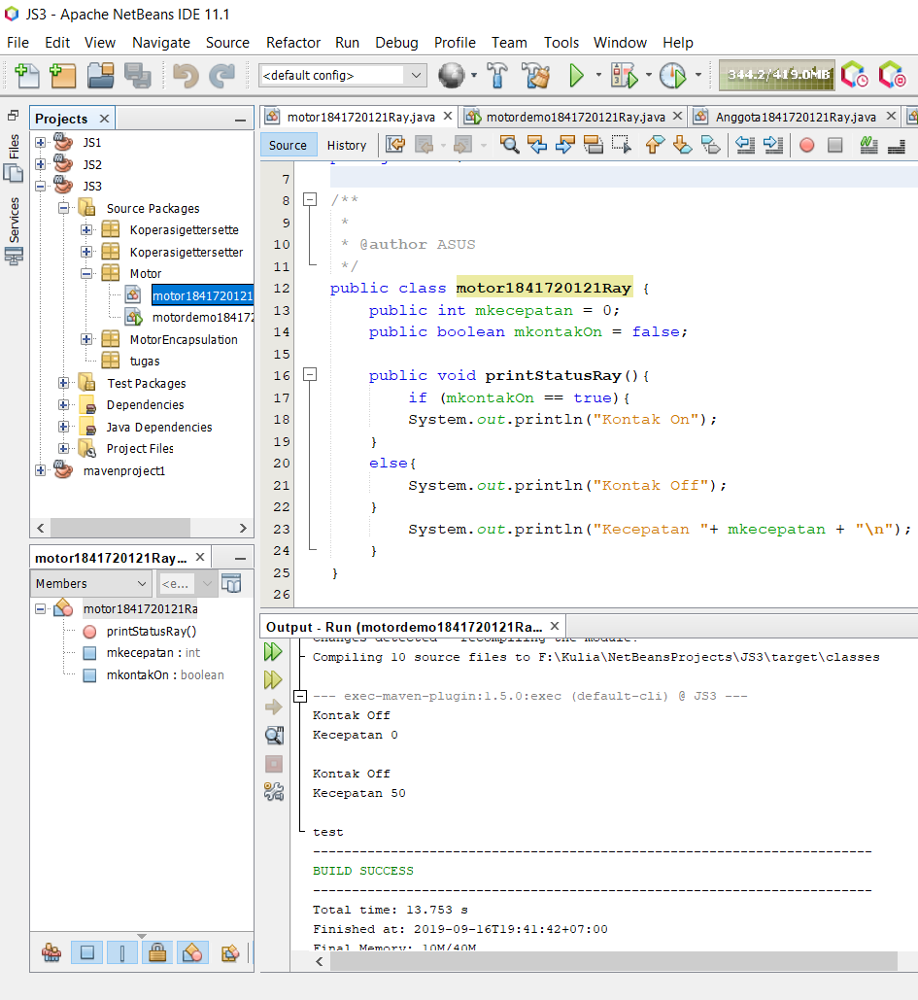

# Laporan Praktikum #3 - Enkapsulasi

## Kompetensi

 Kompetensi
 1. Konstruktor
 2. Akses Modifier
 3. Atribut/method pada class
 4. Intansiasi atribut/method
 5. Setter dan getter
 6. Memahami notasi pada UML Class Diagram

## Ringkasan Materi

Pada praktikum ini saya menemukan kesulitan pada saat akan membuat sebuah inputan pada tugas nomor 6 dimana seperti yang diketahui saat ingin membuat suatu inputan pada method dimana method tersebut tidak bisa mengembalikan nilai sehingga saya merasa kebingungan dan juga tidak mengerti namun hal tersebut saya bisa saya selesaikan setelah saya bertanya pada kakak tingkat dan juga teman saya yang tahu tentang cara pengerjaan untuk tugas nomor 6 tersebut.

## Percobaan

### Percobaan 1 - Enkapsulasi

Pada percobaan pertama adalah membuat class bernama motor1841720121Ray yang memiliki atribut mkecepatan dengan tipe data integer dan mkontakOn dengan tipe data boolean dan terdapat main class motordemo1841720121Ray untuk memanggil fungsi method yang berada di class motor1841720121Ray dan juga terdapat method printStatusRay unutk mendisplay output menampilkan status pada motor.

    Contoh link kode program pada class :
[ini contoh link ke kode program](../../src/3_Enkapsulasi/motor1841720121Ray.java)

    Contoh link kode program pada main class :
[ini contoh link ke kode program](../../src/3_Enkapsulasi/motordemo1841720121Ray.java)

### Percobaan 2 - Access Modifier
Dalam percobaan kedua melakukan perbaiki pada cara kerja class motor1841720121Ray yang ada pada percobaan ke-1 dengan cara menambahkan sebuah method baru yaitu matikanMesinRay, nyalakanMesinRay, kurangiKecepatanRay dan tambahKecepatanRay.

    Contoh link kode program pada class :
[ini contoh link ke kode program](../../src/3_Enkapsulasi/motormodif1841720121Ray.java)

    Contoh link kode program pada main class :
[ini contoh link ke kode program](../../src/3_Enkapsulasi/motormodifdemo1841720121Ray.java)

### Pertanyaan

1. Pada class MotorDemo, saat kita menambah kecepatan untuk pertama kalinya, mengapa muncul peringatan “Kecepatan tidak bisa bertambah karena Mesin Off!”?
2. Mengapat atribut kecepatan dan kontakOn diset private?
3. Ubah class Motor sehingga kecepatan maksimalnya adalah 100!

### Jawaban

1. 
>Pada kontakOn diberi keadaan true (methode tambahkecepatanRay) makan kecepatan akan diberi 5(+=5)jika kontakon false mesin akan off karena false dan kecepatan tidak bertambah.
2. 
>Atribut hanya bisa di gunakan pada class ersebut dan Mencegah nama atribut yang sama.
3. 
> 

    Contoh link kode program pada class :
[ini contoh link ke kode program](../../src/3_Enkapsulasi/Pertanyaan/motormodif1841720121Ray.java)

    Contoh link kode program pada main class :
[ini contoh link ke kode program](../../src/3_Enkapsulasi/Pertanyaan/motormodifdemo1841720121Ray.java)

### Percobaan 3 - Getter dan Setter
    Percobaan 3 membuat class anggota yang memiliki atribut mama(String), alamat(String), simpanan(float) dan memiliki method setalamat, setnama, getalamat, getnama, getsimpanan, setor, pinjam.

    Contoh link kode program pada class :
[ini contoh link ke kode program](../../src/3_Enkapsulasi/Anggota1841720121Ray.java)

    Contoh link kode program pada main class :
[ini contoh link ke kode program](../../src/3_Enkapsulasi/AnggotaDemo1841720121Ray.java)

### Percobaan 4 - Konstruktor, Intansiasi

Percobaan 4 mencoba perubahan pada percobaan 3 (Anggota1841720121Ray.java & AnggotaDemo1841720121Ray.java)

    Contoh link kode program pada class :
[ini contoh link ke kode program](../../src/3_Enkapsulasi/Anggotaanggota1841720121Ray.java)

    Contoh link kode program pada main class :
[ini contoh link ke kode program](../../src/3_Enkapsulasi/AnggotaDemodemo1841720121Ray.java)

### Pertanyaan

1. Apa yang dimaksud getter dan setter?
2. Apa kegunaan dari method getSimpanan()?
3. Method apa yang digunakan untk menambah saldo?
4. Apa yand dimaksud konstruktor?
5. Sebutkan aturan dalam membuat konstruktor?
6. Apakah boleh konstruktor bertipe private?
7. Kapan menggunakan parameter dengan passsing parameter?
8. Apa perbedaan atribut class dan instansiasi atribut?
9. Apa perbedaan class method dan instansiasi method?

### Jawaban

1. 
>setter adalah method untuk mengambil nilai atau isi dari atribut tersebut.
>getter adalah method untuk mengembalikan suatu nilai dari dalam method itu sendiri
2. 
>Untuk mengembalikan nilai pada atribut simpanan.
3. 
>Method yang menambahkan saldo adalah setor().
4. 
>Suatu method khusus yang akan langsung dieksekusi saat melakukan pembuatan suatu objek.
5. 
>a. membuat konstruktur harus memiliki nama yang sama dengan class.

>b. konstruktor tidak dapat diwariskan.

>c. this adalah pernyataan pertama yang di panggil dalam constructor.
6. 
>Tidak, Karenajika konstruktor bertipe private maka objek tidak bisa diakes atau tidak bisa di instansiasi oleh class lain
7. 
>Jika menggunakan konstruktor maka sebaiknya menggunakan passing parameter dan juga sebaliknya.
8. 
>instansiasi memiliki nilai untuk objek dimana setiap objek yang satu dengan yang lain berbeda beda sedangkan Atribut class adalah suatu atribut yang terdapat pada suatu objek
9. 
>Method merupakan suatu operasi berupa fungsi-fungsi yang dapat dikerjakan oleh suatu object.

### Kesimpulan 
Dari percobaan diatas, telah dipelajari kosep dari enkapsulasi, kontruktor, access modifier yang terdiri dari 4 jenis yaitu public, protected, default dan private. Konsep atribut atau method class yang ada di dalam blok code class dan konsep instansiasi atribut atau method. Cara penggunaan getter dan setter beserta fungsi dari getter dan setter. Dan juga telah dipelajari atau memahami notasi UML.

### Tugas

1. Cobalah program dibawah ini dan tuliskan hasil outputnya 

    Contoh link kode program pada class :
[ini contoh link ke kode program](../../src/3_Enkapsulasi/tugas/EncapDemo1841720121Ray.java)

    Contoh link kode program pada main class :
[ini contoh link ke kode program](../../src/3_Enkapsulasi/tugas/EncapTest1841720121Ray.java)

2. Pada program diatas, pada class EncapTest kita mengeset age dengan nilai 35, namun pada saat ditampilkan ke layar nilainya 30, jelaskan mengapa. 

Jawaban : 

3. Ubah program diatas agar atribut age dapat diberi nilai maksimal 30 dan minimal 18. 

Jawaban :

4. Pada sebuah sistem informasi koperasi simpan pinjam, terdapat class Anggota yang memiliki atribut antara lain nomor KTP, nama, limit peminjaman, dan jumlah pinjaman. Anggota dapat meminjam uang dengan batas limit peminjaman yang ditentukan. Anggota juga dapat mengangsur pinjaman. Ketika Anggota tersebut mengangsur pinjaman, maka jumlah pinjaman akan berkurang sesuai dengan nominal yang diangsur. Buatlah class Anggota tersebut, berikan atribut, method dan konstruktor sesuai dengan kebutuhan. Uji dengan TestKoperasi berikut ini untuk memeriksa apakah class Anggota yang anda buat telah sesuai dengan yang diharapkan.

Jawaban :

5. Modifikasi soal no. 4 agar nominal yang dapat diangsur minimal adalah 10% dari jumlah pinjaman saat ini. Jika mengangsur kurang dari itu, maka muncul peringatan “Maaf, angsuran harus 10% dari jumlah pinjaman”. 

Jawaban :

6. Modifikasi class TestKoperasi, agar jumlah pinjaman dan angsuran dapat menerima input dari console. 

Jawaban :

## Pernyataan Diri

Saya menyatakan isi tugas, kode program, dan laporan praktikum ini dibuat oleh saya sendiri. Saya tidak melakukan plagiasi, kecurangan, menyalin/menggandakan milik orang lain.

Jika saya melakukan plagiasi, kecurangan, atau melanggar hak kekayaan intelektual, saya siap untuk mendapat sanksi atau hukuman sesuai peraturan perundang-undangan yang berlaku.

Ttd,

***Muhammad Rayhan Akbar Putra***