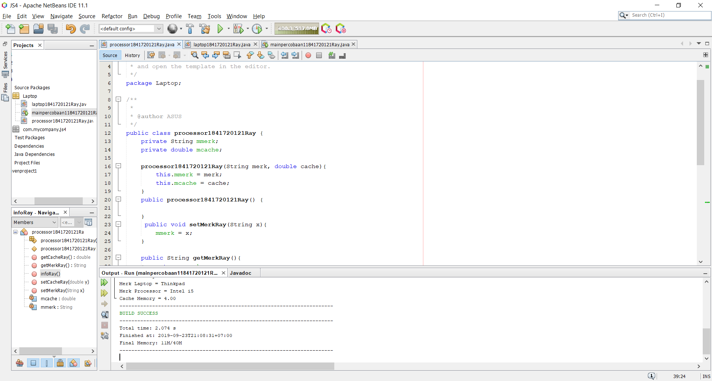

# Laporan Praktikum #4 - Relasi Kelas

## Kompetensi

Setelah menempuh pokok bahasan ini, mahasiswa mampu: 
1. Memahami konsep relasi kelas.
2. Mengimplementasikan relasi has‑a dalam program.

## Ringkasan Materi

Pada praktikum ini saya mengalami kesulitan pada pehaman saya terhadap suatu relasi class dan juga tipe data menggunakan nama class.

## Percobaan

### Percobaan 1

Pada class processor1841720121Ray memiliki konstruktor default dan juga konstruktor berparameter yang memiliki nama sama dengan nama classnya selain itu terdapat juga atribut bernama merk bertipe data string dan cache dengan tipe data double, dan juga memiliki method getter dan setter (getMerkRay(), getCacheRay(), setMerkRay(), setCacheRay(), dan infoRay()). Class laptop1841720121Ray memiliki konstruktor berparameter dengan nama yang sama dengan classnya dan atribut bernama merk bertipe data integer dan atribut proc dengan tipe data processor1841720121Ray yang merupakan class yang digunakan sebagai tipe data atribut tersebut, untuk method yang terdapat pada class ini terdapat method getter dan setter (getMerkRay(), getProcRay(), setMerkRay(), setProcRay(), dan infoRay()). Terdapat mainpercobaan11841720121Ray untuk memanggil fungsi method yang ada pada class Processor1841720121Ray dan juga Laptop1841720121Ray.

Contoh link kode program pada class Processor1841720121Ray.java : [ini contoh link ke kode program](../../src/4_Relasi_Class/Laptop/processor1841720121Ray.java)

Contoh link kode program pada class Laptop1841720121Ray.java : [ini contoh link ke kode program](../../src/4_Relasi_Class/Laptop/laptop1841720121Ray.java)

Contoh link kode program pada main class mainpercobaan11841720121Ray.java : [ini contoh link ke kode program](../../src/4_Relasi_Class/Laptop/mainpercobaan11841720121Ray.java)

### Pertanyaan

Berdasarkan percobaan 1, jawablah pertanyaan‑pertanyaan yang terkait:

1. Di dalam class Processor dan class laptop1841720121Ray, terdapat method setter dan getter untuk masing‑masing atributnya. Apakah gunanya method setter dan getter tersebut ?