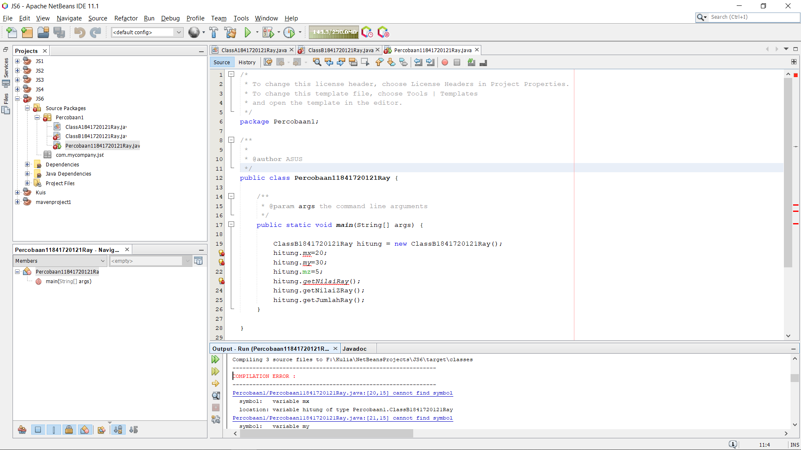

# Laporan Praktikum #6 - Inheritance

## Kompetensi

Setelah menempuh pokok bahasan ini, mahasiswa mampu: 
1. Memahami konsep dasar inheritance atau pewarisan.	
2. Mampu membuat suatu subclass dari suatu superclass tertentu	
3. Mampu mengimplementasikan konsep single dan multilevel inheritance.	
4. Mampu membuat objek dari suatu subclass dan melakukan pengaksesan terhadap atribut dan method baik yang dimiliki sendiri atau turunan dari superclassnya.	
  
## Ringkasan Materi

>Paada praktikum ini saya mengalami kesulitan pada pehaman saya terhadap suatu relasi class dan juga tipe data menggunakan nama class..

## Percobaan

### Percobaan 1

Contoh kode program pada class ClassA1841720121Ray.java : [ini link ke kode program](../../src/6_Inheritance/Percobaan1/ClassA1841720121Ray.java)

Contoh kode program pada class ClassB1841720121Ray.java : [ini link ke kode program](../../src/6_Inheritance/Percobaan1/ClassB1841720121Ray.java)

Contoh kode program pada main class Percobaantest1841720121Ray.java : [ini link ke kode program](../../src/6_Inheritance/Percobaan1/Percobaan11841720121Ray.java)

### Pertanyaan

1. Pada	percobaan 1 diatas program yang dijalankan terjadi error, kemudian perbaiki sehingga program tersebut bisa dijalankan dan tidak error!

    Jawab:

Contoh kode program pada class ClassA1841720121Ray.java : [ini link ke kode program](../../src/6_Inheritance/Percobaan1fix/ClassA1841720121Ray.java)

Contoh kode program pada class ClassB1841720121Ray.java : [ini link ke kode program](../../src/6_Inheritance/Percobaan1fix/ClassB1841720121Ray.java)

Contoh kode program pada main class Percobaantest1841720121Ray.java : [ini link ke kode program](../../src/6_Inheritance/Percobaan1fix/Percobaan11841720121Ray.java)

2. Jelaskan apa penyebab program pada percobaan 1 ketika dijalankan terdapat error!

    Jawab:

    Penyebab kenapa bisa terjadi error adalah karena pada ClassB1841720121Ray belum ditambahkan fungsi extends yang diarahkan ke ClasA1841720121Ray dan juga belum ditambakannya konstruktor ClassA1841720121Ray pada main class Percobaan11841720121Ray.

### Percobaan 2

Contoh kode program pada class ClassA1841720121Ray.java : [ini link ke kode program](../../src/6_Inheritance/Percobaan2/ClassA1841720121Ray.java)

Contoh kode program pada class ClassB1841720121Ray.java : [ini link ke kode program](../../src/6_Inheritance/Percobaan2/ClassB1841720121Ray.java)

Contoh kode program pada main class Percobaan21841720121Ray.java : [ini link ke kode program](../../src/6_Inheritance/Percobaan2/Percobaan21841720121Ray.java)

### Pertanyaan

1. Pada percobaan 2 diatas program yang dijalankan terjadi error, kemudian perbaiki sehingga program tersebut bisa dijalankan dan tidak error!

    Jawab:

Contoh kode program pada class ClassA1841720121Ray.java : [ini link ke kode program](../../src/6_Inheritance/Percobaan2fix/ClassA1841720121Ray.java)

Contoh kode program pada class ClassB1841720121Ray.java : [ini link ke kode program](../../src/6_Inheritance/Percobaan2fix/ClassB1841720121Ray.java)

Contoh kode program pada main class Percobaan21841720121Ray.java : [ini link ke kode program](../../src/6_Inheritance/Percobaan2fix/Percobaan21841720121Ray.java)

2. Jelaskan apa penyebab program pada percobaan 2 ketika dijalankan terdapat error!

    Jawab:

    Alasan kenapa terjadi error adalah karena pada ClassB1841720121Ray belum ditambahkan extends yang diarahkan pada ClassA1841720121Ray dan juga belum diubahnya modifier pada atribut di class ClassA1841720121Ray dari private mejadi protected perubahan pada main class juga dipperlukan dengan mengisi value pada method setter yang telah disediakan.

### Percobaan 3

Contoh kode program pada class ClassA1841720121Ray.java : [ini link ke kode program](../../src/6_Inheritance/Percobaan3/ClassA1841720121Ray.java)

Contoh kode program pada class ClassB1841720121Ray.java : [ini link ke kode program](../../src/6_Inheritance/Percobaan3/ClassB1841720121Ray.java)

Contoh kode program pada main class Percobaan21841720121Ray.java : [ini link ke kode program](../../src/6_Inheritance/Percobaan3/Percobaan21841720121Ray.java)

### Pertanyaan

1. Jelaskan fungsi “super” pada potongan program berikut di class Tabung!

      

    Jawab:

    Fungsi super pada potongan program tersebut adalah untuk memberikan penjelasan pada atribut phi terdapat pada class induk.

2. Jelaskan fungsi “super” dan “this” pada potongan program berikut di class Tabung!	

      

    Jawab:

    Super sendiri menunjukkan bahwa atribut tersebut terletak pada class induk atau bisa dikatakan bahwa atribut ini merupakan atribut milik induk, sedangkan pada this menunjukkan bahwa atribut tersebut terletak pada class subclass tersebut.

3. Jelaskan mengapa pada class Tabung1841720121Ray tidak dideklarasikan atribut “phi” dan “r” tetapi class tersebut dapat mengakses atribut tersebut! 

    Jawab:

    Karena class Tabung1841720121Ray merupakan subclass dari class Bangun1841720121Ray sehingga atribut yang ada pada tersebut walaupun bersifat protected akan diwariskan pada subclassnya.

### Percobaan 4

Contoh kode program pada class ClassA1841720121Ray.java : [ini link ke kode program](../../src/6_Inheritance/Percobaan4/ClassA1841720121Ray.java)

Contoh kode program pada class ClassB1841720121Ray.java : [ini link ke kode program](../../src/6_Inheritance/Percobaan4/ClassB1841720121Ray.java)

Contoh kode program pada class ClassC1841720121Ray.java : [ini link ke kode program](../../src/6_Inheritance/Percobaan4/ClassC1841720121Ray.java)

Contoh kode program pada main class Percobaan41841720121Ray.java : [ini link ke kode program](../../src/6_Inheritance/Percobaan4/Percobaan41841720121Ray.java)

### Pertanyaan

1. Pada percobaan 4 sebutkan mana class yang termasuk superclass dan subclass, kemudian jelaskan alasannya!

    Jawab:

    Yang merupakan Superclass adalah ClassA1841720121Ray dan subclassnya adalah ClassB1841720121Ray kenapa bisa begitu ?, karena ClassA1841720121Ray merupakan class induk yang tidak diwarisi oleh class lain namun mewarikan pada class lain sedangkan pada ClassB1841720121Ray merupakan subclass karena diwariskan dari ClassA1841720121Ray namun bisa dikatakan sebagai superclass juga karena mewariskan pada ClassC1841720121Ray.

2. Ubahlah isi konstruktor default ClassC seperti berikut:	

    Tambahkan kata super() di baris	Pertaman dalam konstruktor defaultnya. Coba jalankan kembali class Percobaan4 dan terlihat tidak ada perbeda dari hasil outputnya!

    Jawab:

3. Ubahlah isi konstruktor default ClassC seperti berikut:	

      

    Ketika mengubah posisi super() dibaris kedua dalam kontruktor defaultnya dan terlihat ada error. Kemudian kembalikan super() kebaris pertama seperti sebelumnya, maka errornya akan hilang.

      

    Jelaskan bagaimana urutan proses jalannya konstruktor saat objek test dibuat!	  

    Jawab:

    ClassC1841720121Ray akan menambahkan super() untuk memanggil konstruktor superclass. penggunaan super() hanya bisa digunakan pada baris pertama dalam konstruktor.

4. Apakah fungsi super() pada potongan program dibawah ini di ClassC!

     

    Jawab:

    Menunjukkan atau memanggil konstruktor superclass.

### Percobaan 5

Contoh kode program pada class Karyawan1841720121Ray.java : [ini link ke kode program](../../src/6_Inheritance/Percobaan5/Karyawan1841720121Ray.java)

Contoh kode program pada class Manager1841720121Ray.java : [ini link ke kode program](../../src/6_Inheritance/Percobaan5/Manager1841720121Ray.java)

Contoh kode program pada class Staff1841720121Ray.java : [ini link ke kode program](../../src/6_Inheritance/Percobaan5/Staff1841720121Ray.java)

Contoh kode program pada main class Inheritance11841720121Ray.java : [ini link ke kode program](../../src/6_Inheritance/Percobaan5/Inheritance11841720121Ray.java)

### Pertanyaan

1. Sebutkan class mana yang termasuk super class dan sub class dari percobaan 1 diatas!	

    Jawab:

    Yang termasuk super class adalah class Karyawan1841720121Ray dan yang merupakan sub class adalah class Manager1841720121Ray dan class Staff1841720121Ray.

2. Kata kunci apakah yang digunakan untuk menurunkan suatu class ke class yang lain?

    Jawab:

    Kata kunci untuk menurunkan suatu class ke class yang lain adalah 'extends'.

3. Perhatikan kode program pada class Manager1841720121Ray, atribut apa saja yang dimiliki oleh class tersebut? Sebutkan atribut mana saja yang diwarisi dari class Karyawan!

    Jawab:

    Yang merupakan atribut yang dimiliki oleh Manager1841720121Ray adalah tunjangan bertipe data integer, dan atribut yang diwariskan dari class Karyawan1841720121Ray ke class Manager1841720121Ray adalah nama, alamat dan jk yang memiliki tipe data String, selain itu juga ada umur dan gaji yang memiliki tipe data integer.

4. Jelaskan kata kunci super pada potongan program dibawah ini yang terdapat pada class Manager1841720121Ray!

    

    Jawab:

    Untuk memanggil atribut gaji pada super class adalah Karyawan1841720121Ray.

5. Program pada percobaan 1 diatas termasuk dalam jenis inheritance apa? Jelaskan alasannya!

    Jawab:

    Termasuk dalam Single inheritance karna hanya memiliki satu parent class atau super class saja.

### Percobaan 6

Contoh kode program pada class StaffTetap1841720121Ray.java : [ini link ke kode program](../../src/6_Inheritance/Percobaan6/StaffTetap1841720121Ray.java)

Contoh kode program pada class StaffHarian1841720121Ray.java : [ini link ke kode program](../../src/6_Inheritance/Percobaan6/StaffHarian1841720121Ray.java)

Contoh kode program pada main class Inheritance11841720121Ray.java : [ini link ke kode program](../../src/6_Inheritance/Percobaan6/Inheritance11841720121Ray.java)

### Pertanyaan

1. Berdasarkan class diatas manakah yang termasuk single inheritance dan mana yang termasuk multilevel inheritance?

    Jawab:

    Yang merupakan single inheritance adalah class Karyawan1841720121Ray yang mewariskan kepada Manager1841720121Ray dan juga Staff1841720121Ray sedabgkan yang merupakan multilevel inheritance adalah keseluruhan mulai dari Karyawan1841720121Ray menurunkan pada kedua sublcass dan subclass yang bernama Staff1841720121Ray menurunkan kepada dua class yaitu StaffTetap1841720121Ray dan StaffHarian1841720121Ray.

2. Perhatikan kode program class StaffTetap1841720121Ray dan StaffHarian1841720121Ray, atribut apa saja yang dimiliki oleh class tersebut? Sebutkan atribut mana saja yang diwarisi dari class Staff!	
  
    Jawab:

    Atribut yang terdapat pada StaffTetap1841720121Ray adalah golongan dengan tipe data String dan asuransi dengan tipe data integer, sedangkan apa saja yang diwarisi dari class Staff1841720121Ray adalah atribut bernama lembur dengan tipe data integer dan golongan dengan tipe data integer serta semua atribut yang ada pada class karyawan1841720121Ray.

3. Apakah fungsi potongan program berikut pada class StaffHarian1841720121Ray

       

    Jawab:

    Memanggil konstruktor class dari parent class, yaitu Staff1841720121Ray.

4. Apakah fungsi potongan program berikut pada class StaffHarian

    

    Jawab:

    Memanggil method tampil pada class Staff1841720121Ray.

5. Perhatikan kode program dibawah ini yang terdapat pada class	StaffTetap

    

    Terlihat dipotongan program diatas atribut gaji, lembur dan potongan dapat diakses langsung. Kenapa hal ini bisa terjadi dan bagaimana class StaffTetap memiliki atribut gaji, lembur, dan potongan padahal dalam class tersebut tidak dideklarasikan atribut gaji, lembur, dan potongan?

    Jawab:

    Bisa, karena StaffTetap1841720121Ray adalah sub class dari class Staff1841720121Ray yang memiliki atribut tersebut.

## Tugas

Buatlah sebuah studi kasus, rancang dengan class diagram, kemudian implementasikan ke dalam program! Studi kasus harus mewakili relasi class dari percobaan‑percobaan yang telah dilakukan pada materi ini, setidaknya melibatkan minimal 4 class (class yang berisi main tidak dihitung). 
 

Contoh kode program pada class Komputer1841720121Ray.java : [ini link ke kode program](../../src/6_Inheritance/Tugas/Komputer1841720121Ray.java)

Contoh kode program pada class Leptop1841720121Ray.java : [ini link ke kode program](../../src/6_Inheritance/Tugas/Leptop1841720121Ray.java)

Contoh kode program pada class Pc1841720121Ray.java : [ini link ke kode program](../../src/6_Inheritance/Tugas/Pc1841720121Ray.java)

Contoh kode program pada class Mac1841720121Ray.java : [ini link ke kode program](../../src/6_Inheritance/Tugas/Mac1841720121Ray.java)

Contoh kode program pada class Windows1841720121Ray.java : [ini link ke kode program](../../src/6_Inheritance/Tugas/Windows1841720121Ray.java)

Contoh kode program pada class main Main1841720121Ray.java : [ini link ke kode program](../../src/6_Inheritance/Tugas/Main1841720121Ray.java)

## Pernyataan Diri

Saya menyatakan isi tugas, kode program, dan laporan praktikum ini dibuat oleh saya sendiri. Saya tidak melakukan plagiasi, kecurangan, menyalin/menggandakan milik orang lain.

Jika saya melakukan plagiasi, kecurangan, atau melanggar hak kekayaan intelektual, saya siap untuk mendapat sanksi atau hukuman sesuai peraturan perundang-undangan yang berlaku.

Ttd,

***Muhammad Rayhan Akbar Putra***