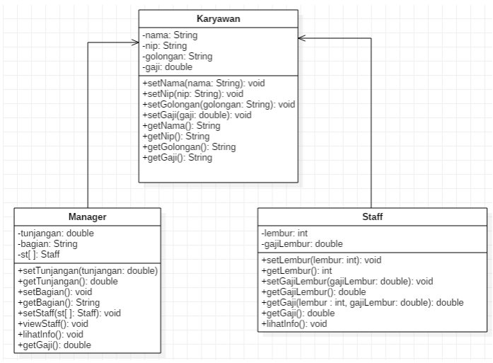
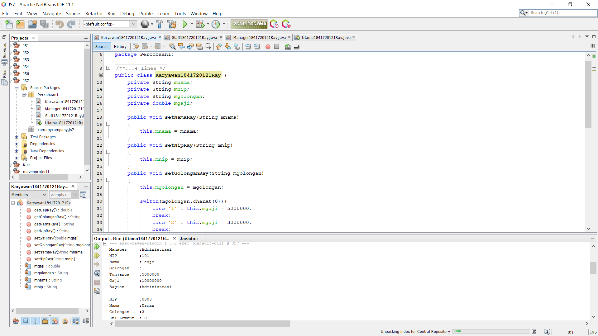
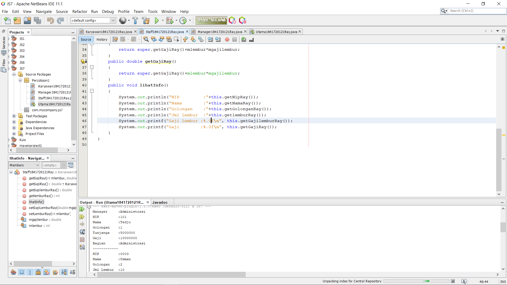
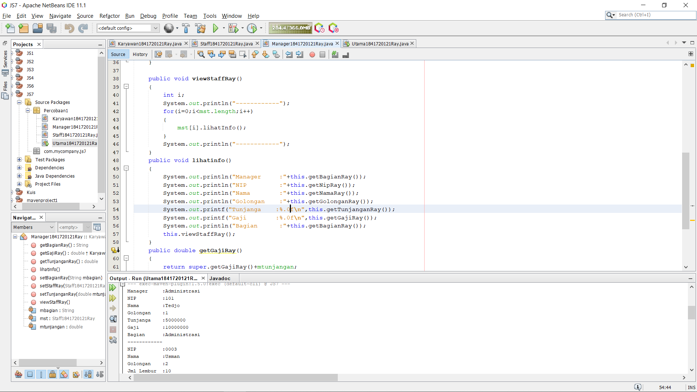
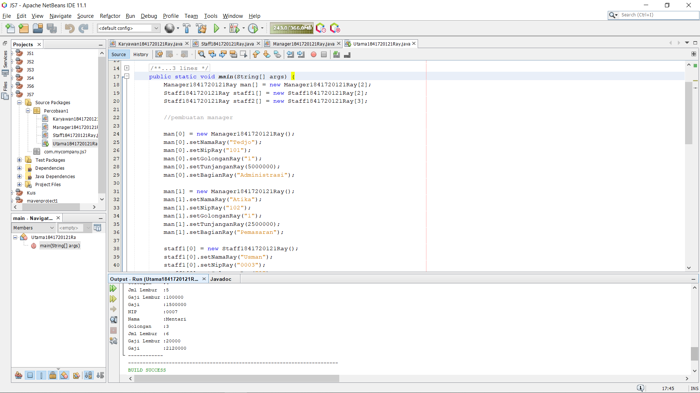
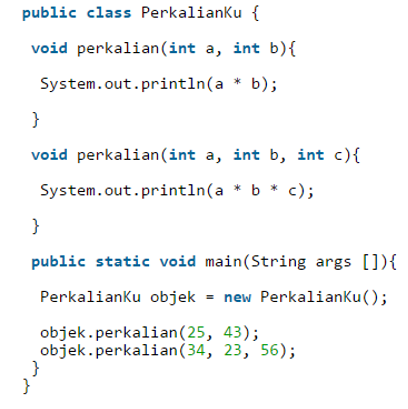
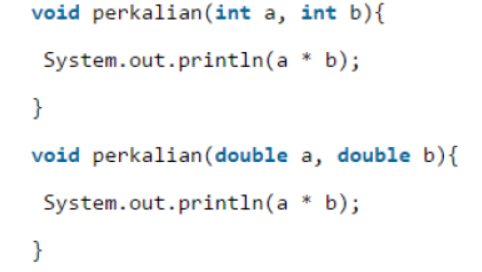
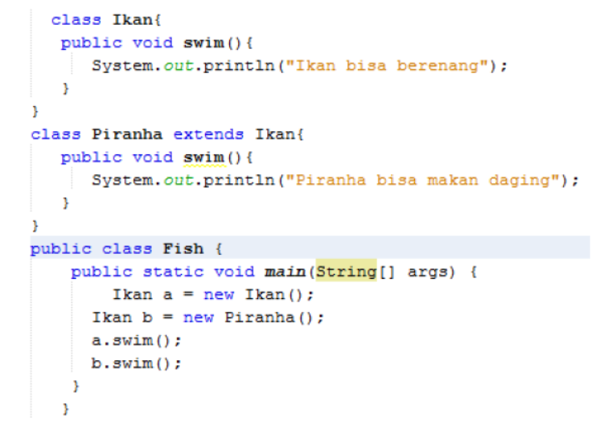
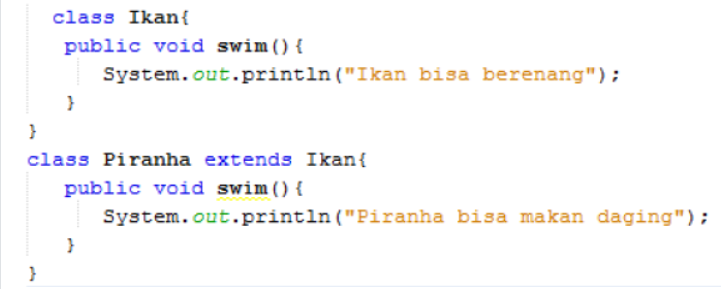

# Laporan Praktikum #7 - Overriding & Overloading

## Kompetensi

Setelah menempuh pokok bahasan ini, mahasiswa mampu: 
1. Memahami konsep overloading dan overriding. 	
2. Memahami perbedaan overloading dan overriding. 	
3. Ketepatan dalam mengidentifikasi method overriding dan overloading.
4. Ketepatan dalam mempraktekkan instruksi pada jobsheet. 
5. 	Mengimplementasikan method overloading dan overriding. 
  
## Ringkasan Materi

>Paada praktikum ini saya mengalami kesulitan pada pehaman saya terhadap suatu relasi class dan juga tipe data menggunakan nama class..

## Percobaan

### Percobaan 1

Untuk kasus contoh berikut ini, terdapat tiga kelas, yaitu Karyawan, Manager, dan Staff. Class Karyawan merupakan superclass dari Manager dan Staff dimana subclass Manager dan Staff memiliki method untuk menghitung gaji yang berbeda. 

Contoh kode program pada class Karyawan1841720121Ray.java : [ini link ke kode program](../../src/7_Overriding_dan_Overloading/Percobaan1/Karyawan1841720121Ray.java)

Contoh kode program pada class Staff1841720121Ray.java : [ini link ke kode program](../../src/7_Overriding_dan_Overloading/Percobaan1/Staff1841720121Ray.java)

Contoh kode program pada class Manager1841720121Ray.java : [ini link ke kode program](../../src/7_Overriding_dan_Overloading/Percobaan1/Manager1841720121Ray.java)

Contoh kode program pada main class Utama1841720121Ray.java : [ini link ke kode program](../../src/7_Overriding_dan_Overloading/Percobaan1/Utama1841720121Ray.java)

### Latihan

1. Dari source coding diatas terletak dimanakah overloading? 

Jawaban :

2. Jika terdapat overloading ada berapa jumlah parameter yang berbeda? 

Jawaban :

2 paramater dari int diubah menjadi double jadi parameter yang berbeda ada 2.

3. Dari source coding diatas terletak dimanakah overloading? 

Jawaban :

4. Jika terdapat overloading ada berapa tipe parameter yang berbeda? 

Jawaban :

method swim dimiliki kelas ikan (Parent)dan kelas ikan piranha(child) mengganti output yang lebih spesifik yaitu ikan piranha bisa makan daging.

## Pernyataan Diri

Saya menyatakan isi tugas, kode program, dan laporan praktikum ini dibuat oleh saya sendiri. Saya tidak melakukan plagiasi, kecurangan, menyalin/menggandakan milik orang lain.

Jika saya melakukan plagiasi, kecurangan, atau melanggar hak kekayaan intelektual, saya siap untuk mendapat sanksi atau hukuman sesuai peraturan perundang-undangan yang berlaku.

Ttd,

***Muhammad Rayhan Akbar Putra***