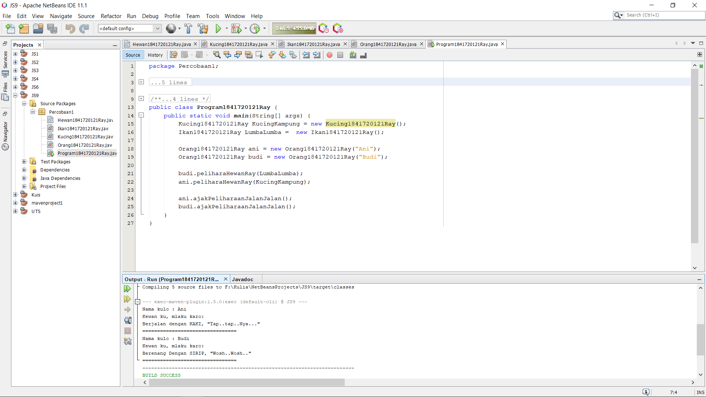
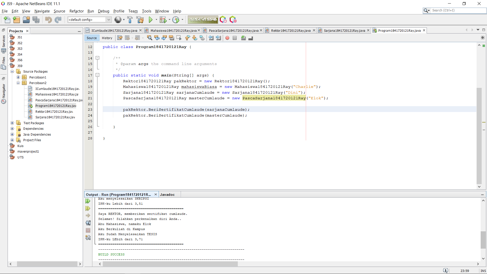
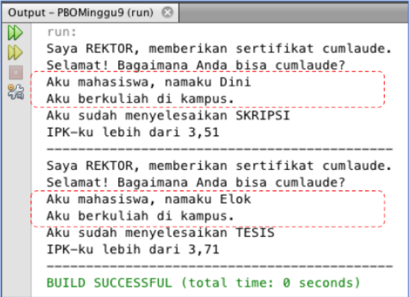
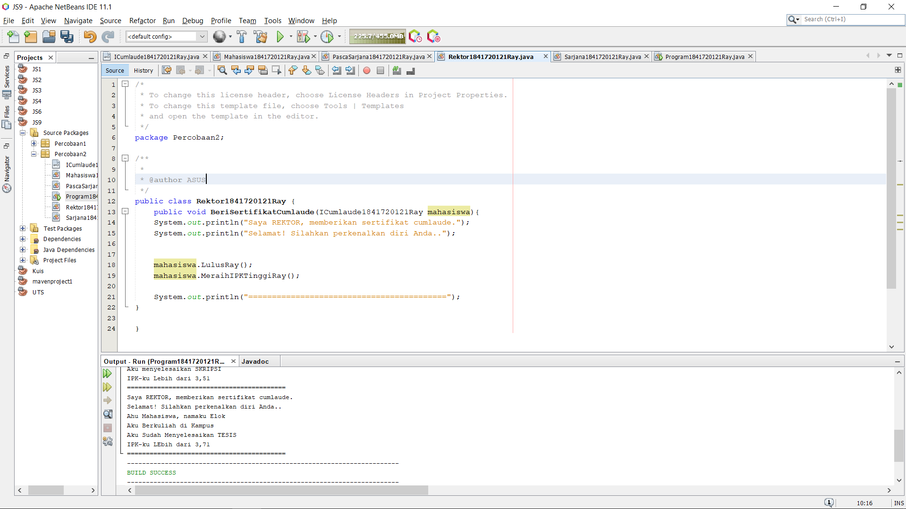
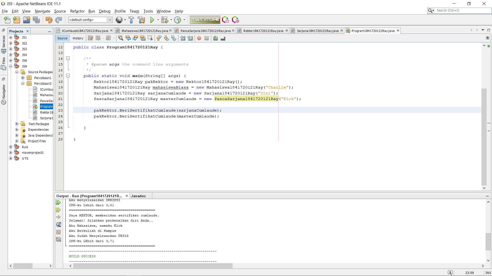
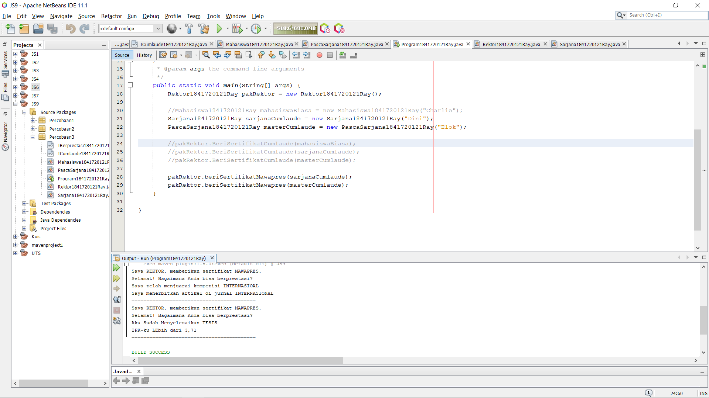

# Laporan Praktikum #9 - Abstract Class & Interface

## Kompetensi

Kompetensi Setelah menyelesaikan lembar kerja ini mahasiswa diharapkan mampu: 
1. Menjelaskan maksud dan tujuan penggunaan Abstract Class; 
2. Menjelaskan maksud dan tujuan penggunaan Interface; 
3. Menerapkan Abstract Class dan Interface di dalam pembuatan program. 

## Ringkasan Materi

>Paada praktikum ini saya mengalami kesulitan pada pehaman saya terhadap suatu relasi class dan juga tipe data menggunakan nama class..

## Percobaan

### Percobaan 1

Kode program pada Percobaan 1 : 

[Hewan1841720121Ray.java](../../src/9_Abstract_Class_dan_Interface/Percobaan1/Hewan1841720121Ray.java)

[Ikan1841720121Ray.java](../../src/9_Abstract_Class_dan_Interface/Percobaan1/Ikan1841720121Ray.java)

[Kucing1841720121Ray.java](../../src/9_Abstract_Class_dan_Interface/Percobaan1/Kucing1841720121Ray.java)

[Orang1841720121Ray.java](../../src/9_Abstract_Class_dan_Interface/Percobaan1/Orang1841720121Ray.java)

[Program1841720121Ray.java](../../src/9_Abstract_Class_dan_Interface/Percobaan1/Program1841720121Ray.java)

### Pertanyaan

Bolehkah apabila sebuah class yang meng-extend suatu abstract class tidak mengimplementasikan method abstract yang ada di class induknya? Buktikan! 

Jawaban : 

Tidak, karena abstrak class harus di implementasikan dengan cara override. 
Jadi metode Lulus tidak diimplementasikan sehingga abstrak class error.

### Percobaan 2

Kode program pada Percobaan 2 : 

[ICumlaude1841720121Ray.java](../../src/9_Abstract_Class_dan_Interface/Percobaan2/ICumlaude1841720121Ray.java)

[Mahasiswa1841720121Ray.java](../../src/9_Abstract_Class_dan_Interface/Percobaan2/Mahasiswa1841720121Ray.java)

[PascaSarjana1841720121Ray.java](../../src/9_Abstract_Class_dan_Interface/Percobaan2/PascaSarjana1841720121Ray.java)

[Rektor1841720121Ray.java](../../src/9_Abstract_Class_dan_Interface/Percobaan2/Rektor1841720121Ray.java)

[Sarjana1841720121Ray.java](../../src/9_Abstract_Class_dan_Interface/Percobaan2/Sarjana1841720121Ray.java)

[Program1841720121Ray.java](../../src/9_Abstract_Class_dan_Interface/Percobaan2/Program1841720121Ray.java)

### Pertanyaan

1. Mengapa pada langkah nomor 9 terjadi error? Jelaskan! 
2. Dapatkah method kuliahDiKampus() dipanggil dari objek sarjanaCumlaude di class Program? Mengapa demikian? 
3. Dapatkah method kuliahDiKampus() dipanggil dari parameter mahasiswa di method beriSertifikatCumlaude() pada class Rektor? Mengapa demikian? 
4. Modifikasilah method beriSertifikatCumlaude() pada class Rektor agar hasil eksekusi class Program menjadi seperti berikut ini: 

Jawaban : 

1. Karena Mahasiswa biasa Tidak memenuhi syarat yang telah untuk mendapat sertifikat cumlaude.

2. Ya Bisa, Karena dipanggil secara manual

3. Ya Bisa, Dengan cara menambahkan abstrak class kuliah dikampus dan di override pada class sarjana dan pascasarjana.

4. 

 

### Percobaan 3

Kode program pada Percobaan 3 : 

[ICumlaude1841720121Ray.java](../../src/9_Abstract_Class_dan_Interface/Percobaan3/ICumlaude1841720121Ray.java)

[Mahasiswa1841720121Ray.java](../../src/9_Abstract_Class_dan_Interface/Percobaan3/Mahasiswa1841720121Ray.java)

[PascaSarjana1841720121Ray.java](../../src/9_Abstract_Class_dan_Interface/Percobaan3/PascaSarjana1841720121Ray.java)

[Rektor1841720121Ray.java](../../src/9_Abstract_Class_dan_Interface/Percobaan3/Rektor1841720121Ray.java)

[Sarjana1841720121Ray.java](../../src/9_Abstract_Class_dan_Interface/Percobaan3/Sarjana1841720121Ray.java)

[Program1841720121Ray.java](../../src/9_Abstract_Class_dan_Interface/Percobaan3/Program1841720121Ray.java)

[IBerprestasi1841720121Ray.java](../../src/9_Abstract_Class_dan_Interface/Percobaan3/IBerprestasi1841720121Ray.java)

### Pertanyaan

Apabila Sarjana Berprestasi harus menjuarai kompetisi NASIONAL dan menerbitkan artikel di jurnal NASIONAL, maka modifikasilah class-class yang terkait pada aplikasi Anda agar di class Program objek pakRektor dapat memberikan sertifikat mawapres pada objek sarjanaCumlaude.

Jawaban :

pada class sarjana dilakunan implementasi abstraksi dengan cara override.

## Kesimpulan

1. Melakukan Implementasi interface
2. Melakukan implementasi class Abstraksi
3. Melakukan Implementasi Multiple Interfaces Implementation

## Pernyataan Diri

Saya menyatakan isi tugas, kode program, dan laporan praktikum ini dibuat oleh saya sendiri. Saya tidak melakukan plagiasi, kecurangan, menyalin/menggandakan milik orang lain.

Jika saya melakukan plagiasi, kecurangan, atau melanggar hak kekayaan intelektual, saya siap untuk mendapat sanksi atau hukuman sesuai peraturan perundang-undangan yang berlaku.

Ttd,

***Muhammad Rayhan Akbar Putra***